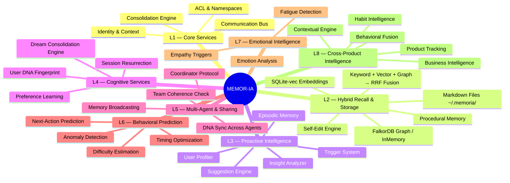
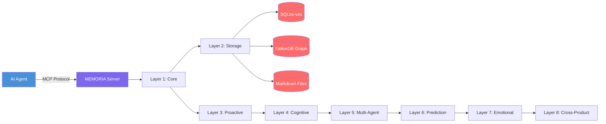
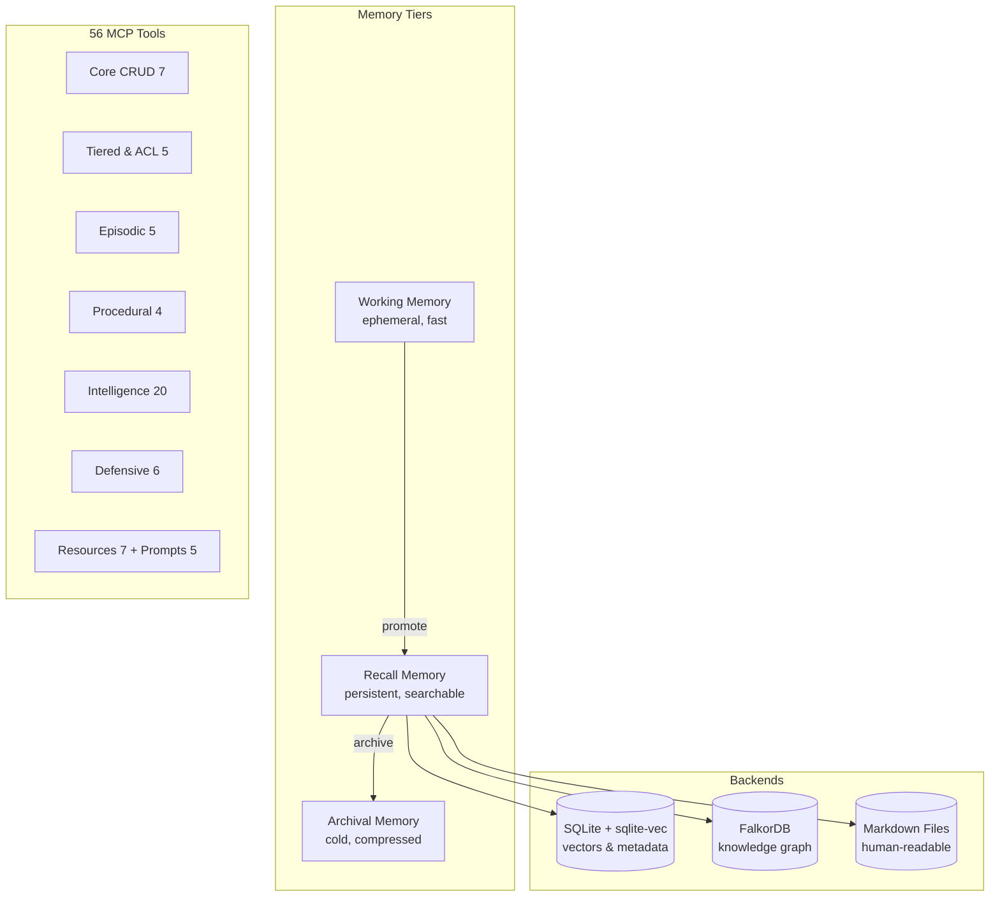

# MEMOR-IA 🧠

**Proactive Memory Framework for AI Agents**

> Inspired by [Mem0](https://github.com/mem0ai/mem0) — extended with agent orchestration, proactive intelligence, and dream consolidation.

[](https://www.python.org/downloads/)
[](LICENSE)
[](docs/MCP_SERVER.md)
[](#tests)

---

**Table of Contents:** [Install](#install) · [Quick Start](#quick-start) · [MCP Server](#mcp-server) · [Architecture](#architecture-8-layers-20-subsystems) · [Features](#features) · [Use Cases](#use-cases--scenarios) · [Examples](#examples) · [Documentation](#documentation) · [Tests](#tests)

---

## Why MEMORIA?

| Need                                    | MEMORIA Solution                                |
| --------------------------------------- | ----------------------------------------------- |
| Agent needs to remember across sessions | Persistent markdown + vector + graph storage    |
| Context window is limited               | Proactive suggestions surface relevant memories |
| Multiple agents need shared knowledge   | Team sharing with coherence checking            |
| Memories become stale over time         | Dream consolidation auto-promotes/forgets       |
| Need to detect injection attacks        | Adversarial protection layer                    |
| Want to predict user behavior           | Markov chain action prediction                  |

## Install

**Requirements:** Python ≥ 3.11

```bash
# Core only (zero dependencies)
pip install -e .

# With MCP server (recommended)
pip install -e ".[mcp]"

# With graph support (FalkorDB):
pip install -e ".[graph]"

# Full install (all optional deps):
pip install -e ".[full]"
```

With [UV](https://github.com/astral-sh/uv) (recommended):

```bash
uv pip install -e ".[full]"
```

## Quick Start

```python
from memoria import Memoria

m = Memoria()

# Store memories
m.add("User prefers TypeScript for frontend", user_id="daniel")
m.add("Working on React dashboard project", user_id="daniel")

# Hybrid search (keyword + vector + graph → RRF fusion)
results = m.search("language preferences", user_id="daniel")

# Proactive suggestions
suggestions = m.suggest(context="starting a new web project", user_id="daniel")

# User profiling
profile = m.profile(user_id="daniel")

# Cross-database insights
insights = m.insights(user_id="daniel")
```

## Architecture (8 Layers, 20 Subsystems)



### Data Flow



### Storage Architecture



## Features

### Core

- 📁 File-based persistent memory (Markdown + YAML frontmatter)
- 🎭 Agent identity & context isolation (contextvars)
- 🔗 Inter-agent communication (Mailbox, MessageBus, Permissions)
- 📦 Context management (token window, compaction, prompt building)
- 💤 Dream consolidation system (5-gate auto-trigger)
- 🎯 Agent orchestration (teams, spawn, fork)

### Storage

- 🔮 Knowledge graph (FalkorDB or zero-dep InMemoryGraph fallback)
- 🧲 Semantic vector search (sqlite-vec or pure Python cosine fallback)
- 📝 Entity extraction (regex-based, no LLM dependency)
- 📊 Temporal tracking (trending concepts, confidence decay)

### Intelligence

- 🧠 Proactive suggestion engine with cooldowns
- 📈 Pattern detection (repetition, sequence, temporal)
- 👤 Client profiling (expertise map, working patterns)
- ⚡ Event-driven triggers (MessageBus integration)
- 💡 Cross-database insight generation

### Recall

- 🔄 Hybrid recall pipeline (3 strategies in parallel)
- 🏆 Reciprocal Rank Fusion (RRF) for result merging
- 🎯 Context filtering and deduplication
- 🔌 Pluggable strategy architecture
- 🔌 MCP Server (Claude Desktop, Cursor integration)

### Episodic & Procedural

- 📖 Episodic memory (session timelines, event recording, temporal search)
- ⚙️ Procedural memory (workflow recording, pattern extraction, step suggestions)
- ✏️ Memory self-editing (importance scoring, budget management)

### User DNA & Cognitive

- 🧬 User DNA (behavioral fingerprinting, coding style, communication profile)
- 💤 Dream Engine (6-phase consolidation cycles, memory replay, insight synthesis)
- 🎛️ Preference Engine (structured preference learning, conflict resolution, confidence evolution)
- 🔄 Context Resurrection (session snapshots, thread tracking, perfect resumption)

### Multi-Agent & Prediction

- 📡 Multi-Agent Sharing (memory broadcasting, team coherence, DNA sync)
- 🔮 Behavioral Prediction (Markov chain action prediction, anomaly detection, timing optimization)
- 💜 Emotional Intelligence (12-emotion analysis, empathy triggers, fatigue/burnout detection)

### Cross-Product Intelligence

- 🏢 Product Ecosystem Intelligence (product tracking, usage profiling, adoption analysis)
- 🔀 Cross-Domain Behavioral Fusion (behavior correlation, workflow detection, churn prediction)
- 🔄 Habit & Routine Intelligence (habit tracking, routine optimization, disruption alerts)
- 🎯 Contextual Intelligence Engine (situation awareness, intent inference, proactive assistance)
- 💰 Business Intelligence Memory (revenue signals, segment classification, lifecycle tracking)

### Defensive Intelligence

- 🛡️ Adversarial Memory Protection (poison detection, hallucination guards, consistency verification, tamper proofing)
- 🧩 Cognitive Load Management (load tracking, overload prevention, complexity adaptation, focus optimization)

## Key Differentiators vs Mem0

| Feature                               | Mem0 | MEMORIA |
| ------------------------------------- | ---- | ------- |
| Memory storage                        | ✅   | ✅      |
| Vector search                         | ✅   | ✅      |
| Knowledge graph                       | ✅   | ✅      |
| Agent orchestration                   | ❌   | ✅      |
| Proactive suggestions                 | ❌   | ✅      |
| Dream consolidation                   | ❌   | ✅      |
| Communication layer                   | ❌   | ✅      |
| Context management                    | ❌   | ✅      |
| Zero-config default                   | ❌   | ✅      |
| MCP Server                            | ❌   | ✅      |
| Behavioral fingerprinting (User DNA)  | ❌   | ✅      |
| Dream-like consolidation cycles       | ❌   | ✅      |
| Cross-session resurrection            | ❌   | ✅      |
| Multi-agent memory sharing            | ❌   | ✅      |
| Behavioral prediction                 | ❌   | ✅      |
| Emotional intelligence                | ❌   | ✅      |
| Episodic & procedural memory          | ❌   | ✅      |
| Memory self-editing                   | ❌   | ✅      |
| Cross-product behavioral intelligence | ❌   | ✅      |
| Adversarial memory protection         | ❌   | ✅      |
| Cognitive load management             | ❌   | ✅      |

## Feature Matrix (20 Subsystems)

| Subsystem               | Key Capabilities                                       | Module                  |
| ----------------------- | ------------------------------------------------------ | ----------------------- |
| Core Memory             | CRUD, hybrid search, RRF fusion                        | `memoria.core`          |
| Knowledge Graph         | Entity extraction, relation mapping                    | `memoria.graph`         |
| Proactive Intelligence  | Suggestions, profiling, insights                       | `memoria.intelligence`  |
| Tiered Storage          | Working/recall/archival tiers, ACL                     | `memoria.tiered`        |
| Episodic Memory         | Session timelines, event recording                     | `memoria.episodic`      |
| Procedural Memory       | Workflow patterns, step suggestions                    | `memoria.procedural`    |
| User DNA                | Behavioral fingerprinting, digital twin                | `memoria.user_dna`      |
| Dream Engine            | 6-phase cognitive consolidation                        | `memoria.dream`         |
| Preference Engine       | Preference learning, conflict resolution               | `memoria.preferences`   |
| Context Resurrection    | Session snapshots, perfect resumption                  | `memoria.resurrection`  |
| Multi-Agent Sharing     | Broadcasting, team coherence, DNA sync                 | `memoria.sharing`       |
| Behavioral Prediction   | Action prediction, anomaly detection                   | `memoria.prediction`    |
| Emotional Intelligence  | 12-emotion analysis, empathy, fatigue                  | `memoria.emotional`     |
| Product Intelligence    | Product tracking, usage profiling, adoption            | `memoria.product_intel` |
| Behavioral Fusion       | Cross-product correlation, workflow detection          | `memoria.fusion`        |
| Habit Intelligence      | Habit tracking, routine optimization, anchors          | `memoria.habits`        |
| Contextual Intelligence | Situation awareness, intent inference, proactive       | `memoria.contextual`    |
| Business Intelligence   | Revenue signals, segmentation, lifecycle, value        | `memoria.biz_intel`     |
| Adversarial Protection  | Poison detection, hallucination guards, tamper proof   | `memoria.adversarial`   |
| Cognitive Load          | Load tracking, overload prevention, focus optimization | `memoria.cognitive`     |

## Examples

```bash
python3 examples/01_basic_memory.py      # CRUD operations
python3 examples/02_knowledge_graph.py   # Graph building & queries
python3 examples/03_semantic_search.py   # Vector similarity search
python3 examples/04_proactive_agent.py   # Profiling & suggestions
python3 examples/05_full_pipeline.py     # All layers end-to-end
```

## MCP Server

MEMORIA exposes **69 tools**, **7 resources**, and **5 prompts** via [Model Context Protocol](https://modelcontextprotocol.io/) for integration with Claude Desktop, Cursor, VS Code, and any MCP-compatible client.

> 📖 **Full reference:** [docs/MCP_SERVER.md](docs/MCP_SERVER.md) — complete tool signatures, parameters, examples, client configs, and Docker deployment.

### Quick Start

```bash
# Install with MCP support
pip install -e ".[mcp]"

# Start in stdio mode (for Claude Desktop, Cursor)
memoria-mcp

# Start in HTTP mode (for testing, web apps)
memoria-mcp --transport http --port 8080
```

### Claude Desktop Configuration

Add to your Claude Desktop config:

```json
{
  "mcpServers": {
    "memoria": {
      "command": "memoria-mcp",
      "args": [],
      "env": {
        "MEMORIA_PROJECT_DIR": "/path/to/your/project"
      }
    }
  }
}
```

### Docker

```bash
# Start MEMORIA + FalkorDB
docker compose up -d

# MEMORIA MCP on http://localhost:8080
# FalkorDB on localhost:6379
```

### Available Tools (56)

#### Core CRUD (7)

| Tool               | Description                              |
| ------------------ | ---------------------------------------- |
| `memoria_add`      | Store a new memory                       |
| `memoria_search`   | Hybrid search (keyword + vector + graph) |
| `memoria_get`      | Retrieve a memory by ID                  |
| `memoria_delete`   | Delete a memory                          |
| `memoria_suggest`  | Generate proactive suggestions           |
| `memoria_profile`  | Get user profile                         |
| `memoria_insights` | Generate cross-database insights         |

#### Tiered & ACL (5)

| Tool                   | Description                     |
| ---------------------- | ------------------------------- |
| `memoria_add_to_tier`  | Store memory in a specific tier |
| `memoria_search_tiers` | Search across memory tiers      |
| `memoria_grant_access` | Grant access to a namespace     |
| `memoria_check_access` | Check access permissions        |
| `memoria_enrich`       | Enrich memory with graph data   |

#### Sync & Stats (2)

| Tool            | Description                           |
| --------------- | ------------------------------------- |
| `memoria_sync`  | Synchronize memories across instances |
| `memoria_stats` | Get memory statistics                 |

#### Episodic Memory (5)

| Tool                | Description                            |
| ------------------- | -------------------------------------- |
| `episodic_start`    | Start an episodic session              |
| `episodic_end`      | End an episodic session                |
| `episodic_record`   | Record an event in the current episode |
| `episodic_timeline` | View episode timeline                  |
| `episodic_search`   | Search episodic memories               |

#### Procedural Memory (4)

| Tool                      | Description                   |
| ------------------------- | ----------------------------- |
| `procedural_record`       | Record a procedural step      |
| `procedural_suggest`      | Get workflow step suggestions |
| `procedural_workflows`    | List recorded workflows       |
| `procedural_add_workflow` | Add a complete workflow       |

#### Importance & Self-Edit (3)

| Tool               | Description              |
| ------------------ | ------------------------ |
| `importance_score` | Score memory importance  |
| `self_edit`        | Self-edit memory content |
| `memory_budget`    | Manage memory budget     |

#### User DNA (2)

| Tool                | Description                       |
| ------------------- | --------------------------------- |
| `user_dna_snapshot` | Get user behavioral fingerprint   |
| `user_dna_collect`  | Collect behavioral data passively |

#### Dream Engine (2)

| Tool                | Description                   |
| ------------------- | ----------------------------- |
| `dream_consolidate` | Run dream consolidation cycle |
| `dream_journal`     | View dream journal entries    |

#### Preferences (2)

| Tool               | Description            |
| ------------------ | ---------------------- |
| `preference_query` | Query user preferences |
| `preference_teach` | Teach a new preference |

#### Resurrection (2)

| Tool               | Description                    |
| ------------------ | ------------------------------ |
| `session_snapshot` | Capture session snapshot       |
| `session_resume`   | Resume from a previous session |

#### Sharing (2)

| Tool                   | Description                   |
| ---------------------- | ----------------------------- |
| `team_share_memory`    | Share memory with team agents |
| `team_coherence_check` | Check team memory coherence   |

#### Prediction (2)

| Tool                  | Description              |
| --------------------- | ------------------------ |
| `predict_next_action` | Predict next user action |
| `estimate_difficulty` | Estimate task difficulty |

#### Emotional (2)

| Tool                    | Description               |
| ----------------------- | ------------------------- |
| `emotion_analyze`       | Analyze emotional state   |
| `emotion_fatigue_check` | Check for fatigue/burnout |

#### Product Intelligence (2)

| Tool            | Description                      |
| --------------- | -------------------------------- |
| `product_track` | Track product usage and adoption |
| `product_graph` | View product ecosystem graph     |

#### Behavioral Fusion (2)

| Tool                     | Description                       |
| ------------------------ | --------------------------------- |
| `fusion_correlate`       | Correlate cross-product behaviors |
| `fusion_detect_workflow` | Detect cross-product workflows    |

#### Habit Intelligence (2)

| Tool             | Description                          |
| ---------------- | ------------------------------------ |
| `habit_track`    | Track user habits and routines       |
| `habit_optimize` | Get routine optimization suggestions |

#### Contextual Intelligence (2)

| Tool                   | Description                    |
| ---------------------- | ------------------------------ |
| `context_situation`    | Assess current user situation  |
| `context_infer_intent` | Infer user intent from context |

#### Business Intelligence (2)

| Tool                   | Description                          |
| ---------------------- | ------------------------------------ |
| `biz_revenue_signals`  | Detect revenue opportunity signals   |
| `biz_segment_classify` | Classify user into business segments |

#### Adversarial Protection (3)

| Tool                              | Description                             |
| --------------------------------- | --------------------------------------- |
| `adversarial_detect_poison`       | Detect memory poisoning attempts        |
| `adversarial_verify_consistency`  | Verify memory consistency and integrity |
| `adversarial_guard_hallucination` | Guard against hallucination in memories |

#### Cognitive Load (3)

| Tool                         | Description                          |
| ---------------------------- | ------------------------------------ |
| `cognitive_track_load`       | Track cognitive load levels          |
| `cognitive_prevent_overload` | Prevent cognitive overload           |
| `cognitive_optimize_focus`   | Optimize focus and reduce complexity |

### Resources (7)

| URI                             | Description                  |
| ------------------------------- | ---------------------------- |
| `memoria://memories`            | List all stored memories     |
| `memoria://config`              | Current configuration        |
| `memoria://profile/{user_id}`   | User profile data            |
| `memoria://stats`               | Memory statistics            |
| `memoria://episodic/timeline`   | Episodic session timeline    |
| `memoria://procedural/patterns` | Procedural workflow patterns |
| `memoria://budget`              | Memory budget status         |

### Prompts (5)

| Prompt                 | Description                           |
| ---------------------- | ------------------------------------- |
| `recall_context`       | Inject relevant memories as context   |
| `suggest_next`         | Generate proactive suggestions prompt |
| `deep_recall`          | Deep multi-strategy memory recall     |
| `consolidation_report` | Dream consolidation summary           |
| `episodic_recap`       | Episodic session recap                |

## Tests

```bash
# Full suite (4000+ tests, ~15s)
python3 -m pytest tests/ -q

# With coverage
python3 -m pytest tests/ --cov=memoria

# E2E backend tests (local — no FalkorDB needed)
python3 -m pytest tests/test_e2e_backends.py -q

# E2E with FalkorDB (requires: docker compose up falkordb)
python3 -m pytest tests/test_e2e_backends.py -q --run-falkordb
```

Or with Make:

```bash
make test            # Quick test run
make test-verbose    # Verbose output
make test-e2e        # E2E backend tests
make test-cov        # With coverage report
```

## Examples

Five runnable examples in [`examples/`](examples/):

| Example                                                   | Description                                             |
| --------------------------------------------------------- | ------------------------------------------------------- |
| [`01_basic_memory.py`](examples/01_basic_memory.py)       | CRUD operations — add, search, get, delete              |
| [`02_knowledge_graph.py`](examples/02_knowledge_graph.py) | Entity extraction, graph building, relationship queries |
| [`03_semantic_search.py`](examples/03_semantic_search.py) | Vector similarity search, TF-IDF embeddings             |
| [`04_proactive_agent.py`](examples/04_proactive_agent.py) | User profiling, pattern analysis, proactive suggestions |
| [`05_full_pipeline.py`](examples/05_full_pipeline.py)     | All layers end-to-end in a multi-session demo           |

```bash
python examples/01_basic_memory.py
```

## Use Cases & Scenarios

Real-world examples showing how MEMORIA works across different domains and contexts.

### 🛠️ Developer Tooling — IDE Coding Assistant

An AI coding assistant that remembers your project context, preferences, and past decisions across sessions.

```python
from memoria import Memoria

m = Memoria(project_dir="/projects/my-app")

# Session 1: The AI learns about the developer
m.add("User prefers TypeScript strict mode with Zod validation", user_id="dev")
m.add("Project uses Next.js 14 App Router with RSC", user_id="dev")
m.preference_teach(user_id="dev", category="framework", key="frontend", value="Next.js")
m.preference_teach(user_id="dev", category="style", key="formatting", value="Prettier + ESLint")

# Record a debugging session
m.episodic_start(session_id="debug-auth")
m.episodic_record(content="OAuth redirect loop caused by missing NEXTAUTH_URL env var",
                  event_type="insight", importance=0.9)
m.procedural_record(tool_name="next-dev", input_data="npm run dev",
                    result="Fixed after adding .env.local", success=True)

# Session 2: Next day, AI recalls everything
prefs = m.preference_query(user_id="dev", category="framework")
# → {"primary": {"value": "Next.js", "confidence": 1.0}}

results = m.search("authentication problems", user_id="dev")
# → Returns the OAuth insight from yesterday

suggestions = m.suggest(context="setting up deployment", user_id="dev")
# → "Remember to set NEXTAUTH_URL in production environment variables"
```

### 📊 SaaS Product Analytics — Churn Prevention

Track product usage patterns, detect churn signals, and predict expansion opportunities.

```python
from memoria import Memoria

m = Memoria()

# Register products in your portfolio
m.product_register(product_id="analytics-pro", name="Analytics Pro", category="analytics")
m.product_register(product_id="dashboard-hub", name="Dashboard Hub", category="project_management")

# Track real usage events
m.product_usage_record(product_id="analytics-pro", feature="custom_reports", action="create")
m.product_usage_record(product_id="analytics-pro", feature="api_access", action="query")
m.product_usage_record(product_id="dashboard-hub", feature="team_boards", action="create")

# Lifecycle tracking
m.biz_lifecycle_update(product_id="analytics-pro",
                       days_active=90, total_events=1500,
                       feature_count=8, engagement_score=0.85,
                       usage_trend="growing", is_expanding=True)

# Revenue signals
m.biz_revenue_signal(signal_type="upsell_opportunity",
                     product_id="analytics-pro",
                     description="User hitting API rate limits, candidate for Enterprise tier",
                     impact=0.9, confidence=0.8)

# Predict churn risk
churn = m.fusion_churn_predict(product_id="analytics-pro")
# → {"churn_risk": 0.12, "factors": ["high_engagement", "growing_usage"]}

# Unified intelligence model
model = m.fusion_unified_model()
# → Cross-product insights, workflow detection, habit analysis
```

### 🤖 Multi-Agent Team — Shared Knowledge Base

Multiple AI agents collaborating on a project with shared memory and coherence checking.

```python
from memoria import Memoria

m = Memoria()

# Agent 1 (Code Review Bot) shares knowledge
m.sharing_share(agent_id="reviewer-bot", namespace="project-alpha",
                key="coding-standards", value="All functions must have type annotations and docstrings")

# Agent 2 (Test Writer Bot) reads shared knowledge
m.sharing_share(agent_id="test-bot", namespace="project-alpha",
                key="test-patterns", value="Use pytest fixtures, minimum 80% branch coverage")

# Access control
m.acl_grant(agent_id="reviewer-bot", namespace="project-alpha", role="writer")
m.acl_grant(agent_id="test-bot", namespace="project-alpha", role="reader")
m.acl_check(agent_id="test-bot", namespace="project-alpha", operation="read")
# → {"allowed": True, "role": "reader"}

# Coherence check — detect contradictions between agents
coherence = m.sharing_coherence(team_id="project-alpha")
# → {"is_coherent": True, "conflicts": [], "shared_keys": 2}
```

### 🎓 Educational Platform — Adaptive Learning

An AI tutor that tracks cognitive load, adapts difficulty, and remembers learning patterns.

```python
from memoria import Memoria

m = Memoria()

# Track student's cognitive state
m.cognitive_record(topic="linear_algebra", complexity=0.8)
m.cognitive_record(topic="probability", complexity=0.5)

# Check if the student is overloaded
overload = m.cognitive_check_overload()
# → {"is_overloaded": False, "load_score": 0.45, "recommendation": "can_continue"}

# Emotional state tracking
emotion = m.emotion_analyze(text="I finally understand eigenvalues! This is amazing!")
# → {"dominant": "joy", "confidence": 0.92, "valence": 0.95}

fatigue = m.emotion_fatigue_check()
# → {"is_fatigued": False, "session_duration": 45, "recommendation": "continue"}

# Predict what the student will study next
prediction = m.predict_next_action()
# → {"predicted_action": "study_probability", "confidence": 0.7}

# Difficulty estimation for new content
diff = m.estimate_difficulty(description="Introduction to Bayesian inference")
# → {"difficulty": 0.65, "estimated_time": "45min", "prerequisites": [...]}
```

### 🏥 Healthcare AI Assistant — Patient Context Memory

A medical AI that maintains patient interaction history with full audit trail.

```python
from memoria import Memoria

m = Memoria()

# Episodic memory for patient interactions
m.episodic_start(session_id="patient-consultation-2024")
m.episodic_record(content="Patient reports persistent headaches for 2 weeks",
                  event_type="observation", importance=0.8)
m.episodic_record(content="Recommended MRI scan based on symptom duration",
                  event_type="decision", importance=0.9)

# Adversarial protection — prevent hallucinated medical data
scan = m.adversarial_scan(content="Patient has no known allergies")
# → {"is_safe": True, "risk_score": 0.01, "threats": []}

# Consistency check against known facts
check = m.adversarial_check_consistency(
    content="Patient has penicillin allergy",
    existing_facts=["Patient has no known allergies"]
)
# → {"is_consistent": False, "contradictions": ["allergy_conflict"], ...}

# Integrity verification — audit trail
m.adversarial_verify_integrity(content="MRI ordered on 2024-03-15", content_id="order-123")

# Session snapshot for handoff to next doctor
m.resurrection_capture(user_id="dr-smith", session_id="patient-consultation-2024")
# Next doctor resumes context
context = m.resurrection_resume(user_id="dr-smith")
```

### 🔌 MCP Integration — Any AI Client

All examples above work through the MCP server with **any compatible client** (Claude Desktop, Cursor, VS Code, custom apps):

```bash
# Start the MCP server
memoria-mcp --transport http --port 8080

# Or via Docker (recommended for production)
docker compose up -d
```

```json
// MCP tool call example (from any client)
{
  "method": "tools/call",
  "params": {
    "name": "memoria_add",
    "arguments": {
      "content": "User prefers dark mode and vim keybindings",
      "user_id": "daniel"
    }
  }
}
```

```json
// Response
{
  "content": [{
    "type": "text",
    "text": "{\"status\": \"created\", \"id\": \"~/.memoria/projects/.../memory/a1b2c3d4.md\"}"
  }]
}
```

> 📖 **Full MCP reference with all 69 tools:** [docs/MCP_SERVER.md](docs/MCP_SERVER.md)

---

## Documentation

Comprehensive documentation in the [`docs/`](docs/) directory:

| Document                                       | Description                                                                                                                  |
| ---------------------------------------------- | ---------------------------------------------------------------------------------------------------------------------------- |
| [**Roadmap**](docs/ROADMAP.md)                     | Feature roadmap v2.1→v3.0: 12 planned features with detailed architecture, code designs, and dependency maps             |
| [**Industrialization**](docs/INDUSTRIALIZATION.md) | Enterprise deployment: AWS (EKS), Azure (AKS), GCP (GKE), Helm charts, CI/CD, security, cost estimates                  |
| [**Product Overview**](docs/BUSINESS.md)       | Business overview, 8 use cases, market position, competitive landscape, licensing                                            |
| [**Data Architecture**](docs/DATA_GUIDE.md)    | Data flow diagrams, storage format, real data examples                                                                       |
| [**E2E Test Report**](docs/E2E_USER_REPORT.md) | Auto-generated report with real MCP request/response data                                                                    |
| [**MCP Server Guide**](docs/MCP_SERVER.md)     | Complete MCP reference: 69 tools, 6 resources, 5 prompts, client config (Claude Desktop, Cursor, VS Code), Docker deployment |
| [**Configuration**](docs/CONFIGURATION.md)     | Environment variables, backend setup (FalkorDB, SQLite-vec), Makefile targets                                                |
| [**API Reference**](docs/API_REFERENCE.md)     | Python API: Memoria class, VectorClient, GraphClient, types                                                                  |
| [**Architecture**](docs/ARCHITECTURE.md)       | 8-layer deep dive, data flow, module map, recall pipeline                                                                    |

## License

Business Source License 1.1 — see [LICENSE](LICENSE) for details.

- **Free** for non-commercial use, development, testing, research, and personal projects
- **Commercial/production** use requires written authorization from the Licensor
- Converts to **Apache 2.0** on March 22, 2030
