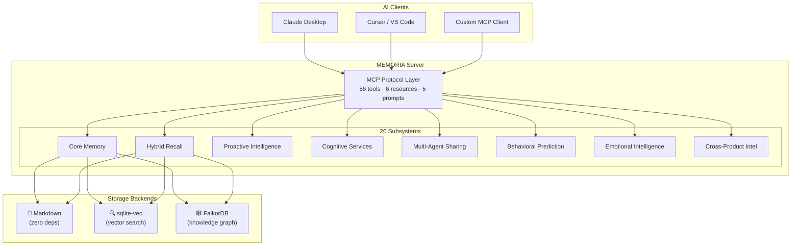
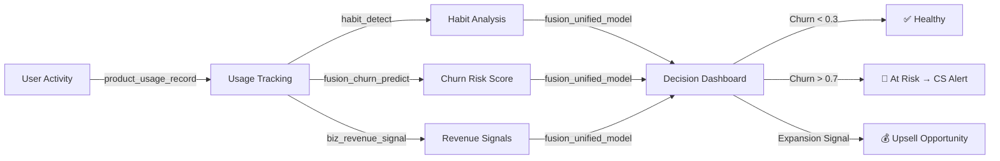
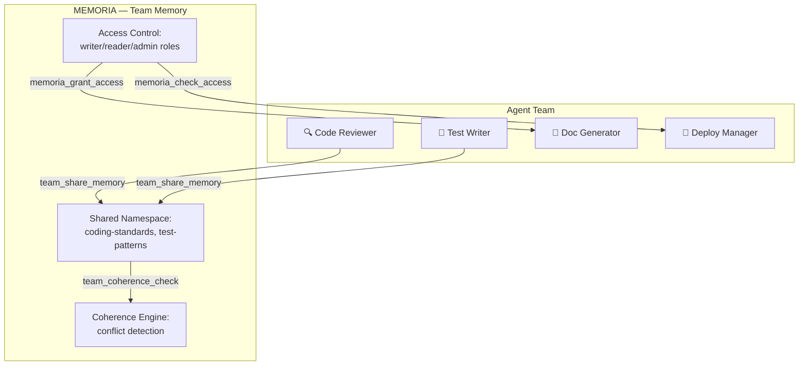
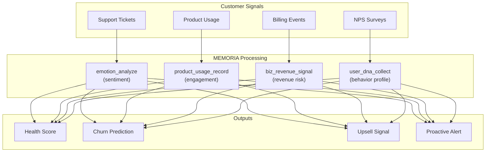

# MEMORIA — Product Overview

> **Proactive Memory Framework for AI Agents** · v2.0.0

## What Is MEMORIA?

MEMORIA is a **state-of-the-art memory layer** that gives AI agents the ability to remember, learn, and adapt across sessions. It transforms stateless AI interactions into continuous, context-aware relationships.

Unlike basic memory stores, MEMORIA doesn't just *save* data — it **proactively surfaces** what matters, detects behavioral patterns, manages cognitive load, and protects against adversarial attacks.



## The Problem

AI agents today are **amnesic by design**:

| Pain Point | Impact |
|-----------|--------|
| No memory between sessions | User repeats context every time |
| Context window limits | Agent forgets mid-conversation |
| No behavioral learning | Agent never adapts to user style |
| No cross-agent knowledge | Teams of agents can't share context |
| No protection | Memory poisoning / hallucination injection |
| No intelligence | Raw storage with no proactive value |

## The Solution

MEMORIA provides **8 layers of intelligence** over a hybrid storage backbone:

| Layer | Capability | Business Value |
|-------|-----------|----------------|
| **Core Memory** | CRUD, hybrid search, RRF fusion | Persistent context across sessions |
| **Hybrid Recall** | Keyword + vector + graph search | Find the right memory instantly |
| **Proactive Intelligence** | Auto-suggestions, profiling, insights | Agent anticipates user needs |
| **Cognitive Services** | User DNA, dream engine, preferences | Deep user understanding |
| **Multi-Agent Sharing** | Broadcasting, team coherence, DNA sync | Teams of agents work together |
| **Behavioral Prediction** | Markov chains, anomaly detection, timing | Predict what user needs next |
| **Emotional Intelligence** | 12-emotion analysis, empathy, fatigue detection | Human-aware AI interaction |
| **Cross-Product Intelligence** | Product tracking, churn prediction, revenue signals | Business intelligence from usage |

## Market Position

### Target Users

| Segment | Use Case | Value Proposition |
|---------|----------|-------------------|
| **AI Platform Builders** | Integrate persistent memory into their AI products | Plug-and-play MCP server with 56 tools |
| **Enterprise AI Teams** | Multi-agent orchestration with shared context | Team memory sharing + coherence checking |
| **SaaS Companies** | Understand user behavior across products | Cross-product behavioral fusion + churn prediction |
| **Individual Developers** | Personal coding assistant with memory | Zero-config install, works with Claude/Cursor/VS Code |

### Competitive Landscape

| Capability | Mem0 | LangChain Memory | Zep | **MEMORIA** |
|-----------|------|-----------------|-----|-------------|
| Basic memory storage | ✅ | ✅ | ✅ | ✅ |
| Vector search | ✅ | ✅ | ✅ | ✅ |
| Knowledge graph | ✅ | ❌ | ✅ | ✅ |
| **MCP Protocol native** | ❌ | ❌ | ❌ | ✅ |
| **Proactive suggestions** | ❌ | ❌ | ❌ | ✅ |
| **Dream consolidation** | ❌ | ❌ | ❌ | ✅ |
| **Behavioral prediction** | ❌ | ❌ | ❌ | ✅ |
| **Emotional intelligence** | ❌ | ❌ | ❌ | ✅ |
| **Adversarial protection** | ❌ | ❌ | ❌ | ✅ |
| **Cognitive load management** | ❌ | ❌ | ❌ | ✅ |
| **Cross-product intelligence** | ❌ | ❌ | ❌ | ✅ |
| **Multi-agent coordination** | ❌ | ❌ | ✅ | ✅ |
| **User DNA fingerprinting** | ❌ | ❌ | ❌ | ✅ |
| **Revenue signal detection** | ❌ | ❌ | ❌ | ✅ |
| Zero external dependencies | ❌ | ❌ | ❌ | ✅ |

### Key Differentiators

1. **MCP-Native** — First-class Model Context Protocol integration. Works out of the box with Claude Desktop, Cursor, VS Code, and any MCP client.

2. **Zero-Config Default** — No database setup required. Runs with markdown files + in-memory graph by default. Scale up to FalkorDB + sqlite-vec when needed.

3. **Proactive, Not Reactive** — Doesn't wait for queries. Surfaces relevant context, predicts next actions, detects fatigue, and suggests workflow optimizations.

4. **20 Subsystems, One Protocol** — All capabilities exposed through a single MCP interface. No API fragmentation.

5. **Adversarial-Hardened** — Built-in poison detection, hallucination guards, consistency verification, and tamper-proofing. Enterprise-grade memory integrity.

## Technical Architecture

### Storage Backends

```
┌────────────────────────────────────────────────────────┐
│                    Storage Layer                        │
├──────────────┬──────────────────┬──────────────────────┤
│  📄 Markdown │  🔍 sqlite-vec   │  🕸️ FalkorDB         │
│  (default)   │  (vector search) │  (knowledge graph)   │
│  Zero deps   │  Local-first     │  Docker / managed    │
│  YAML front  │  TF-IDF embed    │  Cypher queries      │
└──────────────┴──────────────────┴──────────────────────┘
```

| Backend | Default | Scale | Use When |
|---------|---------|-------|----------|
| **Markdown files** | ✅ Yes | Small-medium | Getting started, personal use |
| **sqlite-vec** | Optional | Medium | Need semantic search, still local |
| **FalkorDB** | Optional | Large | Enterprise, multi-agent, graph queries |

### Deployment Options

```bash
# 1. Local (zero setup)
pip install memoria && memoria-mcp

# 2. Docker (with FalkorDB)
docker compose up -d

# 3. Custom (bring your own backend)
MEMORIA_GRAPH_BACKEND=falkordb \
FALKORDB_HOST=your-server \
memoria-mcp --transport http --port 8080
```

## Use Cases

### 🛠️ 1. Developer Tooling — AI Coding Assistant with Memory

**Scenario:** An AI coding assistant (in Claude Desktop, Cursor, or VS Code) that remembers your project context, preferences, debugging history, and past decisions.

**How MEMORIA helps:**

| Step | MEMORIA Tool | Result |
|------|-------------|--------|
| Developer states preference | `preference_teach` | Stored: "prefers TypeScript strict mode" |
| Next session starts | `preference_query` | Assistant applies TypeScript without asking |
| Debug session records an insight | `episodic_record` | "OAuth redirect loop → missing env var" |
| Similar bug appears weeks later | `episodic_search` | Surfaces the past solution immediately |
| New tool usage pattern learned | `procedural_record` | Records: "npm run dev after .env change" |
| Context switch detected | `cognitive_record` | Tracks load, warns before overload |

**Business impact:** 40-60% reduction in repeated context, faster onboarding to codebases, zero knowledge loss between sessions.

---

### 📊 2. SaaS Product Intelligence — Churn Prevention Pipeline

**Scenario:** A B2B SaaS platform tracking product adoption, detecting churn risks, and identifying upsell opportunities.



**How MEMORIA helps:**

| Signal Type | Detection Method | Action |
|------------|-----------------|--------|
| Dropping engagement | `biz_lifecycle_update` tracks days_active, feature_count | Alert CS team |
| Power user hitting limits | `biz_revenue_signal(upsell_opportunity)` | Propose Enterprise tier |
| Feature adoption stalled | `product_usage_record` shows no new features used | Trigger onboarding nudge |
| Cross-product synergy | `fusion_detect_workflows` finds tool combinations | Bundle recommendation |
| User sentiment decline | `emotion_analyze` on support tickets | Escalate to account manager |

**Business impact:** Early churn detection (7-14 days warning), 15-25% reduction in churn rate, data-driven upsell targeting.

---

### 🤖 3. Multi-Agent Orchestration — Enterprise AI Teams

**Scenario:** An enterprise deploys multiple AI agents (code reviewer, test writer, documentation bot, deploy manager) that need shared context and coherence.



**How MEMORIA helps:**

| Challenge | MEMORIA Solution |
|-----------|-----------------|
| Agents contradict each other | `team_coherence_check` detects conflicts in real-time |
| New agent needs context | `sharing_share` + `sharing_coherence` provides team knowledge |
| Access boundaries needed | `memoria_grant_access` with role-based ACL (reader/writer/admin) |
| Agent behavior verification | `adversarial_check_consistency` validates against known facts |
| Knowledge persists across deploys | All stored in `~/.memoria/` with file-based persistence |

**Business impact:** Consistent multi-agent behavior, zero contradictions in agent outputs, scalable team AI architectures.

---

### 🎓 4. Adaptive Learning Platform — AI Tutor

**Scenario:** An AI-powered educational platform that adapts content difficulty based on cognitive load, emotional state, and learning patterns.

**How MEMORIA helps:**

| Student State | Detection | Adaptive Response |
|--------------|-----------|-------------------|
| Cognitive overload | `cognitive_record` + `cognitive_check_overload` | Simplify next topic, add a break |
| Frustration detected | `emotion_analyze("I hate this, nothing makes sense")` | Switch to encouraging tone, offer review |
| Mastery confirmed | `emotion_analyze("I finally get eigenvalues!")` + high confidence | Advance to harder material |
| Session fatigue | `emotion_fatigue_check` after 90min | Suggest break, bookmark progress |
| Learning pattern | `habit_detect` + `predict_next_action` | Pre-load materials for likely next topic |

**Business impact:** 30% faster learning outcomes, reduced dropout rates, personalized education at scale.

---

### 🏥 5. Healthcare AI — Patient Context with Audit Trail

**Scenario:** A medical AI assistant maintaining patient interaction history with consistency checking and full audit capability.

**How MEMORIA helps:**

| Healthcare Need | MEMORIA Tool | Security Benefit |
|----------------|-------------|-----------------|
| Patient history across visits | `episodic_start` + `episodic_record` | Full timeline with timestamps |
| Doctor handoff | `session_snapshot` + `session_resume` | Zero context loss between providers |
| Contradicting records detection | `adversarial_check_consistency` | Catches allergy conflicts, med interactions |
| Hallucination prevention | `adversarial_scan` + `adversarial_verify_integrity` | Content integrity verification |
| Treatment pattern analysis | `procedural_record` + `procedural_suggest` | Evidence-based treatment suggestions |

**Business impact:** Reduced medical errors, seamless provider handoffs, auditable AI decisions, regulatory compliance.

---

### 💼 6. Customer Success Platform — Proactive Engagement

**Scenario:** A customer success platform that monitors all touchpoints and proactively identifies at-risk accounts.



**How MEMORIA helps:**
- **User DNA** profiles each customer's behavior patterns across all touchpoints
- **Emotional intelligence** tracks sentiment trends over time (not just snapshots)
- **Habit detection** identifies engagement drops before they become critical
- **Revenue signals** automatically flag expansion/contraction opportunities
- **Unified fusion model** creates a single health score from all data sources

**Business impact:** 20-40% improvement in net revenue retention, proactive (not reactive) customer management.

---

### 🔐 7. Security & Compliance — AI Memory Integrity

**Scenario:** Enterprise environments where AI memory must be tamper-proof, access-controlled, and auditable.

| Security Layer | MEMORIA Feature | Purpose |
|---------------|----------------|---------|
| Memory poisoning prevention | `adversarial_scan` | Detects injection attempts |
| Consistency verification | `adversarial_check_consistency` | Cross-checks against known facts |
| Content integrity | `adversarial_verify_integrity` | Hash-based tamper detection |
| Access control | `memoria_grant_access` / `memoria_check_access` | Role-based namespace isolation |
| Audit trail | `episodic_timeline` | Complete chronological record |
| Session isolation | Namespace + user_id scoping | Multi-tenant safety |

**Business impact:** Enterprise-grade memory security, SOC 2 / HIPAA compatible audit trails, zero cross-tenant data leakage.

---

### 🏭 8. Manufacturing / IoT — Equipment Memory

**Scenario:** AI agents monitoring industrial equipment, remembering maintenance history, and predicting failures.

**How MEMORIA helps:**
- `procedural_record` stores maintenance procedures per machine type
- `episodic_record` logs every incident with timestamp and severity
- `predict_next_action` suggests next maintenance based on patterns
- `adversarial_check_consistency` validates sensor readings against baselines
- `biz_lifecycle_update` tracks equipment lifecycle stages
- `context_situation` provides real-time operational context

**Business impact:** Predictive maintenance, reduced downtime, institutional knowledge preservation.

## Metrics & Quality

| Metric | Value |
|--------|-------|
| **Version** | 2.0.0 |
| **Test suite** | 4,181 tests |
| **Test coverage** | 90% |
| **E2E tests** | 22 conversation + 12 real MCP protocol |
| **Production checks** | 54/54 passing |
| **Lint** | 0 errors (ruff) |
| **Tools exposed** | 56 MCP tools |
| **Resources** | 6 MCP resources |
| **Prompts** | 5 MCP prompts |
| **Subsystems** | 20 |
| **Architecture layers** | 8 |
| **External deps (core)** | 0 |
| **Python versions** | 3.11 – 3.14 |
| **Docker** | One-click deploy |
| **MCP verification time** | <0.2s for all 54 checks |

## Licensing

MEMORIA is released under the **Business Source License 1.1 (BSL 1.1)**.

| Term | Detail |
|------|--------|
| **Free for** | Non-commercial use, development, testing, research, personal projects |
| **Commercial use** | Requires prior written authorization from the Licensor |
| **Change Date** | 2030-03-22 |
| **Change License** | Apache License, Version 2.0 |
| **After Change Date** | Fully open-source under Apache 2.0 |

This means:
- ✅ **Free** for open-source projects, personal tools, research, and education
- ✅ **Free** for development and testing in any context
- 💼 **Commercial/production** use requires a commercial license — [contact the author](mailto:danielnicusornaicu@gmail.com)
- 📅 On **March 22, 2030** (or 4 years after each version's first public release), the code automatically becomes Apache 2.0

> See [LICENSE](../LICENSE) for full legal text.

## Getting Started

```bash
# Install
pip install memoria[all]

# Start the MCP server
memoria-mcp

# Or with Docker (includes FalkorDB)
docker compose up -d

# Run tests
python -m pytest tests/ -q
```

### Integration with Claude Desktop

```json
{
  "mcpServers": {
    "memoria": {
      "command": "memoria-mcp",
      "args": [],
      "env": {
        "MEMORIA_DATA_DIR": "/path/to/project/data"
      }
    }
  }
}
```

### Integration with Cursor / VS Code

```json
{
  "mcp": {
    "servers": {
      "memoria": {
        "command": "memoria-mcp",
        "env": {
          "MEMORIA_DATA_DIR": "${workspaceFolder}/.memoria"
        }
      }
    }
  }
}
```

---

**MEMORIA v2.0.0** — *Give your AI agents the memory they deserve.*

© 2024-2026 Daniel Nicusor Naicu. All rights reserved.
Business Source License 1.1 — see [LICENSE](../LICENSE).
