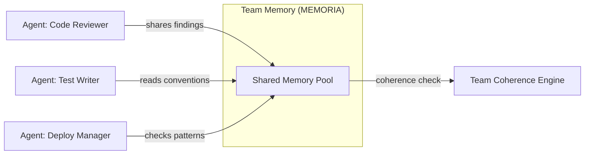

# MEMORIA — Product Overview

> **Proactive Memory Framework for AI Agents**

## What Is MEMORIA?

MEMORIA is a **state-of-the-art memory layer** that gives AI agents the ability to remember, learn, and adapt across sessions. It transforms stateless AI interactions into continuous, context-aware relationships.

Unlike basic memory stores, MEMORIA doesn't just *save* data — it **proactively surfaces** what matters, detects behavioral patterns, manages cognitive load, and protects against adversarial attacks.

```
                    ┌─────────────────────────────┐
                    │      AI Agent / Copilot      │
                    └──────────┬──────────────────-┘
                               │ MCP Protocol
                    ┌──────────▼──────────────────-┐
                    │       MEMORIA Server          │
                    │   56 tools · 7 resources      │
                    │   5 prompts · 20 subsystems   │
                    ├───────────────────────────────┤
                    │  📄 Markdown   🔍 Vector      │
                    │  🕸️ Graph      📊 Analytics    │
                    └───────────────────────────────┘
```

## The Problem

AI agents today are **amnesic by design**:

| Pain Point | Impact |
|-----------|--------|
| No memory between sessions | User repeats context every time |
| Context window limits | Agent forgets mid-conversation |
| No behavioral learning | Agent never adapts to user style |
| No cross-agent knowledge | Teams of agents can't share context |
| No protection | Memory poisoning / hallucination injection |
| No intelligence | Raw storage with no proactive value |

## The Solution

MEMORIA provides **8 layers of intelligence** over a hybrid storage backbone:

| Layer | Capability | Business Value |
|-------|-----------|----------------|
| **Core Memory** | CRUD, hybrid search, RRF fusion | Persistent context across sessions |
| **Hybrid Recall** | Keyword + vector + graph search | Find the right memory instantly |
| **Proactive Intelligence** | Auto-suggestions, profiling, insights | Agent anticipates user needs |
| **Cognitive Services** | User DNA, dream engine, preferences | Deep user understanding |
| **Multi-Agent Sharing** | Broadcasting, team coherence, DNA sync | Teams of agents work together |
| **Behavioral Prediction** | Markov chains, anomaly detection, timing | Predict what user needs next |
| **Emotional Intelligence** | 12-emotion analysis, empathy, fatigue detection | Human-aware AI interaction |
| **Cross-Product Intelligence** | Product tracking, churn prediction, revenue signals | Business intelligence from usage |

## Market Position

### Target Users

| Segment | Use Case | Value Proposition |
|---------|----------|-------------------|
| **AI Platform Builders** | Integrate persistent memory into their AI products | Plug-and-play MCP server with 56 tools |
| **Enterprise AI Teams** | Multi-agent orchestration with shared context | Team memory sharing + coherence checking |
| **SaaS Companies** | Understand user behavior across products | Cross-product behavioral fusion + churn prediction |
| **Individual Developers** | Personal coding assistant with memory | Zero-config install, works with Claude/Cursor/VS Code |

### Competitive Landscape

| Capability | Mem0 | LangChain Memory | Zep | **MEMORIA** |
|-----------|------|-----------------|-----|-------------|
| Basic memory storage | ✅ | ✅ | ✅ | ✅ |
| Vector search | ✅ | ✅ | ✅ | ✅ |
| Knowledge graph | ✅ | ❌ | ✅ | ✅ |
| **MCP Protocol native** | ❌ | ❌ | ❌ | ✅ |
| **Proactive suggestions** | ❌ | ❌ | ❌ | ✅ |
| **Dream consolidation** | ❌ | ❌ | ❌ | ✅ |
| **Behavioral prediction** | ❌ | ❌ | ❌ | ✅ |
| **Emotional intelligence** | ❌ | ❌ | ❌ | ✅ |
| **Adversarial protection** | ❌ | ❌ | ❌ | ✅ |
| **Cognitive load management** | ❌ | ❌ | ❌ | ✅ |
| **Cross-product intelligence** | ❌ | ❌ | ❌ | ✅ |
| **Multi-agent coordination** | ❌ | ❌ | ✅ | ✅ |
| **User DNA fingerprinting** | ❌ | ❌ | ❌ | ✅ |
| **Revenue signal detection** | ❌ | ❌ | ❌ | ✅ |
| Zero external dependencies | ❌ | ❌ | ❌ | ✅ |

### Key Differentiators

1. **MCP-Native** — First-class Model Context Protocol integration. Works out of the box with Claude Desktop, Cursor, VS Code, and any MCP client.

2. **Zero-Config Default** — No database setup required. Runs with markdown files + in-memory graph by default. Scale up to FalkorDB + sqlite-vec when needed.

3. **Proactive, Not Reactive** — Doesn't wait for queries. Surfaces relevant context, predicts next actions, detects fatigue, and suggests workflow optimizations.

4. **20 Subsystems, One Protocol** — All capabilities exposed through a single MCP interface. No API fragmentation.

5. **Adversarial-Hardened** — Built-in poison detection, hallucination guards, consistency verification, and tamper-proofing. Enterprise-grade memory integrity.

## Technical Architecture

### Storage Backends

```
┌────────────────────────────────────────────────────────┐
│                    Storage Layer                        │
├──────────────┬──────────────────┬──────────────────────┤
│  📄 Markdown │  🔍 sqlite-vec   │  🕸️ FalkorDB         │
│  (default)   │  (vector search) │  (knowledge graph)   │
│  Zero deps   │  Local-first     │  Docker / managed    │
│  YAML front  │  TF-IDF embed    │  Cypher queries      │
└──────────────┴──────────────────┴──────────────────────┘
```

| Backend | Default | Scale | Use When |
|---------|---------|-------|----------|
| **Markdown files** | ✅ Yes | Small-medium | Getting started, personal use |
| **sqlite-vec** | Optional | Medium | Need semantic search, still local |
| **FalkorDB** | Optional | Large | Enterprise, multi-agent, graph queries |

### Deployment Options

```bash
# 1. Local (zero setup)
pip install memoria && memoria-mcp

# 2. Docker (with FalkorDB)
docker compose up -d

# 3. Custom (bring your own backend)
MEMORIA_GRAPH_BACKEND=falkordb \
FALKORDB_HOST=your-server \
memoria-mcp --transport http --port 8080
```

## Use Cases

### 1. Personal AI Assistant Memory

> "Remember that I prefer TypeScript for frontend and Python for backend."

The agent stores this once and applies it to every future suggestion — across sessions, across projects.

### 2. Enterprise Multi-Agent Orchestration



### 3. SaaS Product Intelligence

MEMORIA tracks product usage and detects:
- **Churn risk** — decreased engagement, negative sentiment
- **Upsell signals** — power user behavior, feature exploration
- **Workflow patterns** — how users combine products

### 4. AI-Powered Customer Success

```
User starts trial
  → MEMORIA tracks onboarding behavior
  → Detects confusion patterns (cognitive load)
  → Triggers proactive assistance
  → Records emotional state (frustration?)
  → Predicts churn risk at day 7
  → Sends revenue signal to CS team
```

## Metrics & Quality

| Metric | Value |
|--------|-------|
| **Test suite** | 4,078 tests |
| **Test coverage** | Full subsystem coverage |
| **E2E tests** | 12 real MCP protocol scenarios |
| **Tools exposed** | 56 MCP tools |
| **Resources** | 7 MCP resources |
| **Prompts** | 5 MCP prompts |
| **Subsystems** | 20 |
| **Architecture layers** | 8 |
| **External deps (core)** | 0 |
| **Python versions** | 3.11 – 3.14 |
| **Docker** | One-click deploy |

## Licensing

MEMORIA is released under the **Business Source License 1.1 (BSL 1.1)**.

| Term | Detail |
|------|--------|
| **Free for** | Non-commercial use, development, testing, research, personal projects |
| **Commercial use** | Requires prior written authorization from the Licensor |
| **Change Date** | 2030-03-22 |
| **Change License** | Apache License, Version 2.0 |
| **After Change Date** | Fully open-source under Apache 2.0 |

This means:
- ✅ **Free** for open-source projects, personal tools, research, and education
- ✅ **Free** for development and testing in any context
- 💼 **Commercial/production** use requires a commercial license — [contact the author](mailto:danielnicusornaicu@gmail.com)
- 📅 On **March 22, 2030** (or 4 years after each version's first public release), the code automatically becomes Apache 2.0

> See [LICENSE](../LICENSE) for full legal text.

## Getting Started

```bash
# Install
pip install memoria[all]

# Start the MCP server
memoria-mcp

# Or with Docker (includes FalkorDB)
docker compose up -d

# Run tests
python -m pytest tests/ -q
```

### Integration with Claude Desktop

```json
{
  "mcpServers": {
    "memoria": {
      "command": "memoria-mcp",
      "args": [],
      "env": {
        "MEMORIA_PROJECT_DIR": "/path/to/project"
      }
    }
  }
}
```

### Integration with Cursor / VS Code

```json
{
  "mcp": {
    "servers": {
      "memoria": {
        "command": "memoria-mcp",
        "env": {
          "MEMORIA_PROJECT_DIR": "${workspaceFolder}"
        }
      }
    }
  }
}
```

---

**MEMORIA** — *Give your AI agents the memory they deserve.*

© 2024-2026 Daniel Nicusor Naicu. All rights reserved.
Business Source License 1.1.
