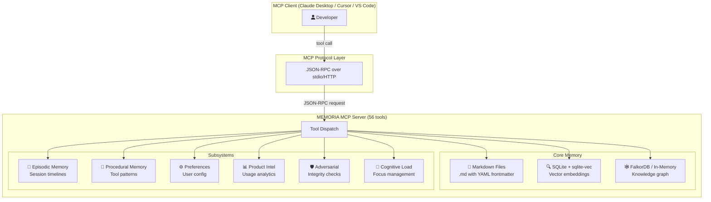
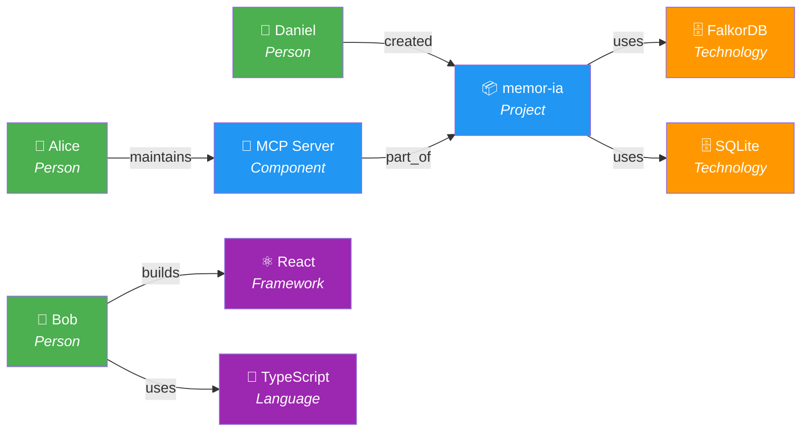
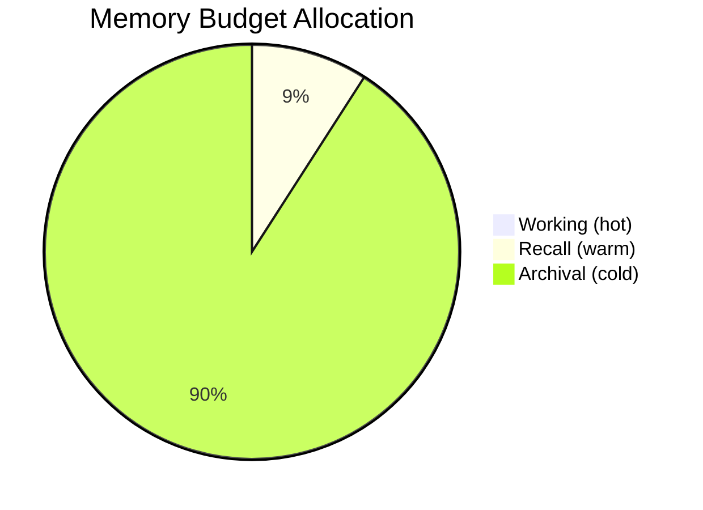
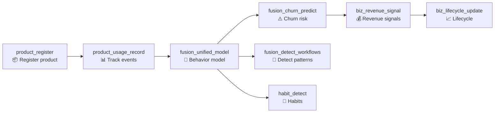

# MEMORIA — Data Architecture & Usage Guide

> How data flows through MEMORIA, with real examples from E2E tests.

## Architecture Overview



## Memory File Format

Each memory is stored as a Markdown file with YAML frontmatter:

```markdown
---
name: "Daniel created memor-ia using Python 3.12 and FalkorDB"
description: "Daniel created memor-ia, a proactive memory framework..."
type: "project"
---

Daniel created memor-ia, a proactive memory framework for AI agents.
Uses FalkorDB for graph, SQLite+sqlite-vec for vectors.
```

**Fields:**
| Field | Type | Description |
|-------|------|-------------|
| `name` | string | Short title (auto-generated from content) |
| `description` | string | Full description (first ~120 chars) |
| `type` | enum | `user`, `project`, `system` |

**Storage path:** `~/.claude/projects/<project-hash>/memory/<id>.md`

### Example: 5 Memories Created

```
memory/
├── b66f1415.md  →  "Daniel created memor-ia using Python 3.12..."  (project)
├── 6978c5e6.md  →  "Alice maintains the MCP server with 56 tools"  (project)
├── e59c1502.md  →  "The CI/CD uses GitHub Actions + Docker..."      (project)
├── b9547f1b.md  →  "sqlite-vec doesn't support INSERT OR REPLACE"  (user)
└── 81e87d32.md  →  "Use ruff for linting, pytest for testing..."   (user)
```

## Knowledge Graph

When content is enriched, MEMORIA extracts entities and relationships:



### Enrichment Response

```json
{
  "category": "relationship",
  "tags": ["typescript", "react"],
  "entities": ["typescript", "react"],
  "entity_types": {
    "typescript": "Concept",
    "react": "Concept"
  }
}
```

## Episodic Timeline

Debugging sessions are recorded as episodes with typed events:

```mermaid
gantt
    title Episode: "Fix vector upsert bug"
    dateFormat X
    axisFormat %S

    section Events
    🔍 INSERT OR REPLACE fails     :observation, 0, 1
    💡 Use DELETE+INSERT pattern    :decision, 1, 2
    🎯 All 4044 tests pass         :milestone, 2, 3
    ✅ Episode ended (success)      :done, 3, 4
```



### Episodic Timeline Data

```json
[
  {
    "event_id": "0616925316fa",
    "event_type": "observation",
    "content": "INSERT OR REPLACE fails on sqlite-vec",
    "timestamp": 1775125614.334
  },
  {
    "event_id": "7c40bc994cfd",
    "event_type": "decision",
    "content": "Use DELETE+INSERT pattern",
    "timestamp": 1775125614.335
  },
  {
    "event_id": "30244af22212",
    "event_type": "milestone",
    "content": "All 4044 tests pass after fix",
    "timestamp": 1775125614.337
  }
]
```

**Valid event types:** `context_switch`, `decision`, `error`, `insight`,
`interaction`, `milestone`, `observation`, `tool_use`

## Procedural Memory (Tool Patterns)

MEMORIA learns from tool usage to suggest the right tools:

```json
{
  "stats": {
    "total_tool_patterns": 3,
    "tools_tracked": ["grep", "pytest", "docker"],
    "total_workflows": 1,
    "top_tools": [
      ["pytest", 2],
      ["grep", 1],
      ["docker", 1]
    ]
  }
}
```

### Workflow Example

```json
{
  "name": "deploy-and-test",
  "description": "Full deploy+test cycle",
  "tags": ["deploy", "test"],
  "steps": [
    {"tool": "docker", "input": "docker compose build", "description": "Build"},
    {"tool": "docker", "input": "docker compose up -d", "description": "Deploy"},
    {"tool": "pytest", "input": "pytest tests/test_e2e_backends.py", "description": "E2E"}
  ]
}
```

## Memory Budget & Tiered Storage



```json
{
  "working":  {"current": 0, "max": 50,   "usage": 0.0},
  "recall":   {"current": 0, "max": 500,  "usage": 0.0},
  "archival":  {"current": 0, "max": 5000, "usage": 0.0},
  "action_needed": "none"
}
```

**Tier semantics:**
| Tier | Max | Purpose | Example |
|------|-----|---------|---------|
| Working | 50 | Active sprint context | "Current bug: sqlite-vec upsert" |
| Recall | 500 | Reference knowledge | "Architecture: event-driven pattern" |
| Archival | 5000 | Historical | "Sprint 1 retro notes" |

## Product Intelligence Pipeline



### Valid Enums

**Product categories:** `billing`, `crm`, `ide`, `project_management`,
`communication`, `analytics`, `storage`, `security`

**Revenue signal types:** `upsell_opportunity`, `cross_sell_opportunity`,
`churn_risk`, `expansion_signal`, `contraction_signal`, `renewal_risk`,
`advocacy_signal`

## System Configuration

```json
{
  "version": "2.0.0",
  "backends": {
    "graph": "KnowledgeGraph",
    "vector": "VectorClient",
    "embedder": "TFIDFEmbedder"
  },
  "features": {
    "hybrid_recall": true,
    "proactive_suggestions": true,
    "knowledge_graph": true,
    "vector_search": true,
    "episodic_memory": true,
    "procedural_memory": true,
    "importance_scoring": true,
    "self_editing": true
  }
}
```

## Preference System

Valid preference categories:

| Category | Example key | Example value |
|----------|-------------|---------------|
| `language` | `primary` | `python` |
| `framework` | `web` | `fastapi` |
| `tool` | `linter` | `ruff` |
| `style` | `type_hints` | `strict` |
| `workflow` | `commit_style` | `conventional_commits` |
| `communication` | `verbosity` | `concise` |
| `architecture` | `pattern` | `event_driven` |
| `testing` | `runner` | `pytest` |

## Full Stats Example

```json
{
  "core": {
    "total_memories": 5,
    "memory_dir": "~/.claude/projects/<hash>/memory"
  },
  "episodic": {
    "total_episodes": 1,
    "active_episode": null,
    "total_events": 3,
    "episodes_by_outcome": {"success": 1},
    "event_type_distribution": {
      "observation": 1,
      "decision": 1,
      "milestone": 1
    }
  },
  "procedural": {
    "total_tool_patterns": 3,
    "tools_tracked": ["grep", "pytest", "docker"],
    "total_workflows": 1,
    "top_tools": [["pytest", 2], ["grep", 1], ["docker", 1]]
  },
  "self_edit": {
    "total_edits": 0,
    "budget": {
      "max_working_memories": 50,
      "max_recall_memories": 500,
      "max_archival_memories": 5000,
      "max_total_tokens": 100000,
      "compress_threshold": 0.85,
      "forget_threshold": 0.95
    }
  }
}
```

## Quick Start

```bash
# Install
pip install memoria[all]

# Start with Docker (includes FalkorDB)
docker compose up -d

# Or run locally
memoria-mcp --project-dir ./my-project

# Run E2E tests
python -m pytest tests/test_e2e_mcp_client.py -v -s

# Run full test suite (4078 tests)
python -m pytest tests/ -q
```

## Tool Reference (56 tools)

| Category | Tools | Count |
|----------|-------|-------|
| **Core Memory** | `memoria_add`, `memoria_search`, `memoria_get`, `memoria_delete`, `memoria_suggest`, `memoria_profile`, `memoria_insights`, `memoria_stats`, `memoria_enrich`, `memoria_sync` | 10 |
| **Tiered Storage** | `memoria_add_to_tier`, `memoria_search_tiers` | 2 |
| **Access Control** | `memoria_grant_access`, `memoria_check_access` | 2 |
| **Episodic** | `episodic_start`, `episodic_end`, `episodic_record`, `episodic_timeline`, `episodic_search` | 5 |
| **Procedural** | `procedural_record`, `procedural_suggest`, `procedural_workflows`, `procedural_add_workflow` | 4 |
| **Importance** | `importance_score`, `self_edit`, `memory_budget` | 3 |
| **User DNA** | `user_dna_snapshot`, `user_dna_collect` | 2 |
| **Dream** | `dream_consolidate`, `dream_journal` | 2 |
| **Preferences** | `preference_query`, `preference_teach` | 2 |
| **Session** | `session_snapshot`, `session_resume` | 2 |
| **Team** | `team_share_memory`, `team_coherence_check` | 2 |
| **Prediction** | `predict_next_action`, `estimate_difficulty` | 2 |
| **Emotion** | `emotion_analyze`, `emotion_fatigue_check` | 2 |
| **Product** | `product_register`, `product_usage_record` | 2 |
| **Fusion** | `fusion_unified_model`, `fusion_churn_predict`, `fusion_detect_workflows`, `habit_detect` | 4 |
| **Context** | `context_situation`, `context_infer_intent` | 2 |
| **Business** | `biz_revenue_signal`, `biz_lifecycle_update` | 2 |
| **Adversarial** | `adversarial_scan`, `adversarial_check_consistency`, `adversarial_verify_integrity` | 3 |
| **Cognitive** | `cognitive_record`, `cognitive_check_overload`, `cognitive_focus_session` | 3 |
