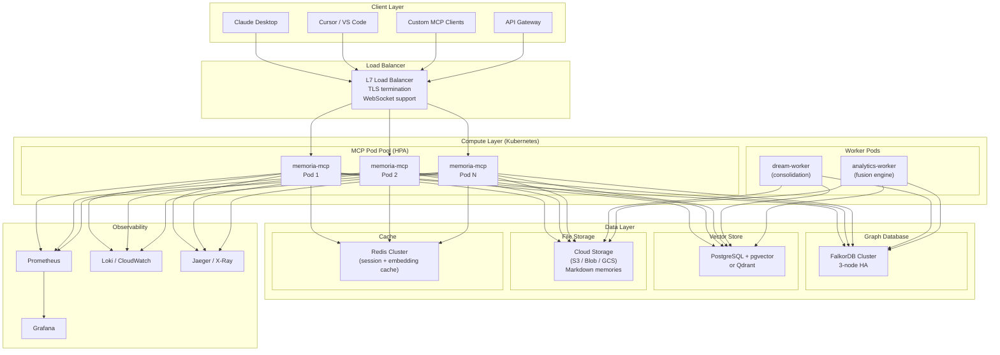
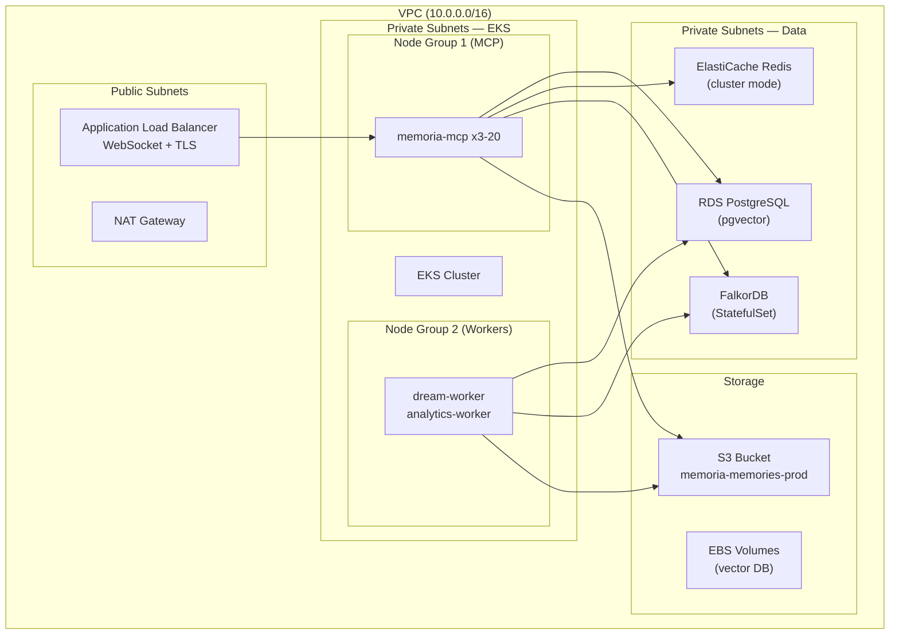
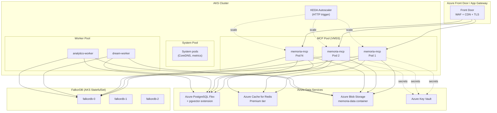
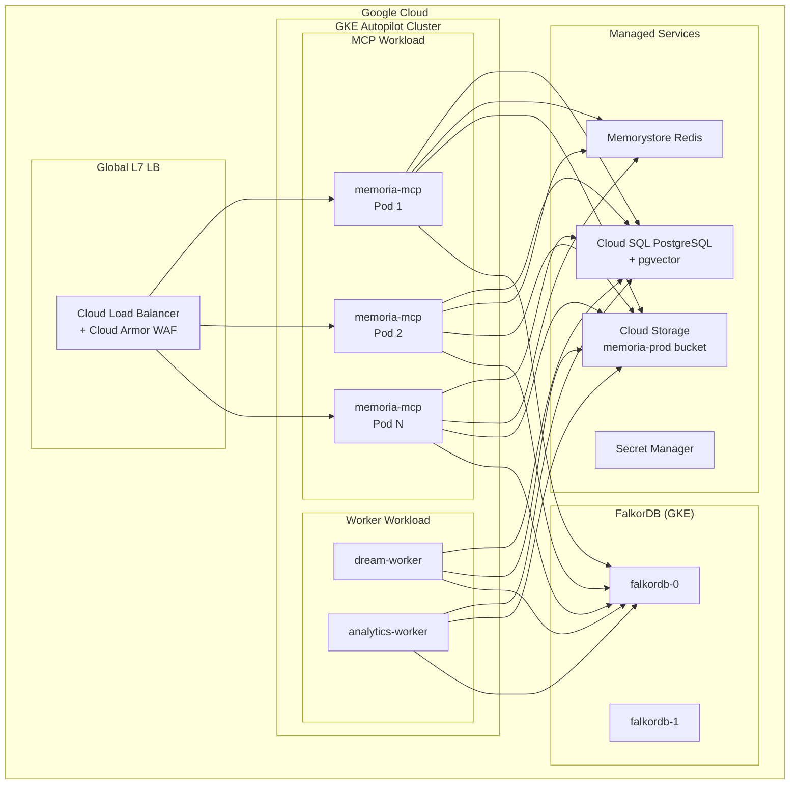
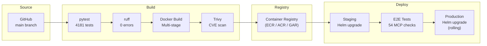

# MEMORIA — Industrialization Guide

> **Enterprise-grade deployment architectures for AWS, Azure, and Google Cloud**
>
> v2.0.0 | BSL 1.1

---

## Overview

This guide covers how to take MEMORIA from a single-container deployment to a **production-grade, scalable, highly available** system running on major cloud platforms. Each architecture is designed for real enterprise workloads with proper observability, security, and auto-scaling.

**Target audience:** Platform engineers, SREs, DevOps teams deploying MEMORIA for production AI workloads.

---

## Architecture Principles

| Principle | Implementation |
|-----------|---------------|
| **Stateless MCP pods** | MEMORIA MCP server is stateless — scale horizontally |
| **External storage** | FalkorDB + PostgreSQL/SQLite replace in-process storage |
| **Shared persistence** | Cloud-native storage (EBS, Azure Disks, GCS) for markdown files |
| **Zero downtime deploys** | Rolling updates with health checks on `/mcp` |
| **Observability** | Prometheus metrics, structured JSON logging, distributed tracing |
| **Security** | mTLS between services, secrets in vault, network policies |
| **Multi-tenancy** | Namespace isolation per tenant, RBAC via MEMORIA ACL layer |

---

## Reference Architecture (Cloud-Agnostic)



---

## AWS Architecture (EKS)

### Components

| Component | AWS Service | Purpose |
|-----------|------------|---------|
| **Container Orchestration** | Amazon EKS (Kubernetes) | Manage MCP server pods |
| **MCP Server** | EKS Pods + HPA | Auto-scaling MCP instances |
| **Graph Database** | FalkorDB on EC2/EKS or Amazon Neptune | Knowledge graph storage |
| **Vector Database** | Amazon RDS (PostgreSQL + pgvector) or OpenSearch | Semantic search |
| **File Storage** | Amazon S3 + S3 CSI Driver | Markdown memory files |
| **Cache** | Amazon ElastiCache (Redis) | Session + embedding cache |
| **Load Balancer** | ALB with WebSocket support | L7 traffic routing |
| **Secrets** | AWS Secrets Manager | API keys, DB credentials |
| **Monitoring** | CloudWatch + Prometheus + Grafana | Metrics + logs + dashboards |
| **Tracing** | AWS X-Ray | Distributed request tracing |
| **CI/CD** | AWS CodePipeline or GitHub Actions | Automated deployments |
| **Container Registry** | Amazon ECR | Docker image storage |

### EKS Deployment Manifest

```yaml
# memoria-deployment.yaml
apiVersion: apps/v1
kind: Deployment
metadata:
  name: memoria-mcp
  namespace: memoria
  labels:
    app: memoria-mcp
    version: v2.0.0
spec:
  replicas: 3
  selector:
    matchLabels:
      app: memoria-mcp
  strategy:
    type: RollingUpdate
    rollingUpdate:
      maxSurge: 1
      maxUnavailable: 0
  template:
    metadata:
      labels:
        app: memoria-mcp
        version: v2.0.0
      annotations:
        prometheus.io/scrape: "true"
        prometheus.io/port: "9090"
    spec:
      serviceAccountName: memoria-sa
      containers:
        - name: memoria-mcp
          image: <account-id>.dkr.ecr.<region>.amazonaws.com/memoria:2.0.0
          ports:
            - containerPort: 8080
              name: mcp
            - containerPort: 9090
              name: metrics
          env:
            - name: MEMORIA_DATA_DIR
              value: /data/memoria
            - name: MEMORIA_GRAPH_BACKEND
              value: falkordb
            - name: FALKORDB_HOST
              valueFrom:
                configMapKeyRef:
                  name: memoria-config
                  key: falkordb-host
            - name: FALKORDB_PORT
              value: "6379"
            - name: MEMORIA_VECTOR_DB
              value: /data/vectors/vectors.db
          resources:
            requests:
              cpu: 500m
              memory: 512Mi
            limits:
              cpu: 2000m
              memory: 2Gi
          livenessProbe:
            httpGet:
              path: /mcp
              port: 8080
              httpHeaders:
                - name: Accept
                  value: application/json
            initialDelaySeconds: 10
            periodSeconds: 30
          readinessProbe:
            httpGet:
              path: /mcp
              port: 8080
              httpHeaders:
                - name: Accept
                  value: application/json
            initialDelaySeconds: 5
            periodSeconds: 10
          volumeMounts:
            - name: memoria-data
              mountPath: /data/memoria
            - name: vector-data
              mountPath: /data/vectors
      volumes:
        - name: memoria-data
          persistentVolumeClaim:
            claimName: memoria-pvc
        - name: vector-data
          persistentVolumeClaim:
            claimName: vector-pvc
---
apiVersion: v1
kind: Service
metadata:
  name: memoria-mcp
  namespace: memoria
spec:
  type: ClusterIP
  ports:
    - port: 8080
      targetPort: 8080
      name: mcp
    - port: 9090
      targetPort: 9090
      name: metrics
  selector:
    app: memoria-mcp
---
apiVersion: autoscaling/v2
kind: HorizontalPodAutoscaler
metadata:
  name: memoria-mcp-hpa
  namespace: memoria
spec:
  scaleTargetRef:
    apiVersion: apps/v1
    kind: Deployment
    name: memoria-mcp
  minReplicas: 3
  maxReplicas: 20
  metrics:
    - type: Resource
      resource:
        name: cpu
        target:
          type: Utilization
          averageUtilization: 70
    - type: Resource
      resource:
        name: memory
        target:
          type: Utilization
          averageUtilization: 80
```

### AWS Network Architecture



### Cost Estimate (AWS — Medium Scale)

| Component | Spec | Monthly Cost (est.) |
|-----------|------|-------------------|
| EKS Cluster | 1 cluster | ~$73 |
| EC2 Nodes (MCP) | 3x m6i.large | ~$230 |
| EC2 Nodes (Workers) | 1x m6i.large | ~$77 |
| RDS PostgreSQL | db.r6g.large, Multi-AZ | ~$380 |
| ElastiCache Redis | cache.r6g.large, 2 nodes | ~$340 |
| FalkorDB (EC2) | 1x r6i.large | ~$130 |
| S3 | 100GB + requests | ~$5 |
| ALB | 1 ALB + traffic | ~$30 |
| **Total** | | **~$1,265/mo** |

---

## Azure Architecture (AKS)

### Components

| Component | Azure Service | Purpose |
|-----------|--------------|---------|
| **Container Orchestration** | Azure Kubernetes Service (AKS) | Manage MCP server pods |
| **MCP Server** | AKS Pods + KEDA | Auto-scaling MCP instances |
| **Graph Database** | FalkorDB on AKS or Azure Cosmos DB (Gremlin) | Knowledge graph |
| **Vector Database** | Azure Database for PostgreSQL (pgvector) or Azure AI Search | Semantic search |
| **File Storage** | Azure Blob Storage + CSI Driver | Markdown memories |
| **Cache** | Azure Cache for Redis | Session + embedding cache |
| **Load Balancer** | Azure Application Gateway / Front Door | L7 routing + WAF |
| **Secrets** | Azure Key Vault | Secrets management |
| **Monitoring** | Azure Monitor + Prometheus + Grafana | Observability stack |
| **Tracing** | Application Insights | Distributed tracing |
| **CI/CD** | Azure DevOps or GitHub Actions | Pipelines |
| **Container Registry** | Azure Container Registry (ACR) | Image storage |

### AKS Architecture



### AKS Deployment with KEDA

```yaml
# memoria-keda-scaler.yaml
apiVersion: keda.sh/v1alpha1
kind: ScaledObject
metadata:
  name: memoria-mcp-scaler
  namespace: memoria
spec:
  scaleTargetRef:
    name: memoria-mcp
  pollingInterval: 15
  cooldownPeriod: 60
  minReplicaCount: 3
  maxReplicaCount: 30
  triggers:
    - type: prometheus
      metadata:
        serverAddress: http://prometheus-server.monitoring:9090
        metricName: http_requests_per_second
        query: sum(rate(http_requests_total{deployment="memoria-mcp"}[2m]))
        threshold: "100"
    - type: cpu
      metricType: Utilization
      metadata:
        value: "70"
```

### Azure Terraform Snippet

```hcl
# main.tf — AKS + supporting services
resource "azurerm_kubernetes_cluster" "memoria" {
  name                = "memoria-aks-prod"
  location            = azurerm_resource_group.memoria.location
  resource_group_name = azurerm_resource_group.memoria.name
  dns_prefix          = "memoria"
  kubernetes_version  = "1.29"

  default_node_pool {
    name                = "system"
    node_count          = 2
    vm_size             = "Standard_D4s_v5"
    vnet_subnet_id      = azurerm_subnet.aks.id
    enable_auto_scaling = true
    min_count           = 2
    max_count           = 5
  }

  identity {
    type = "SystemAssigned"
  }

  network_profile {
    network_plugin = "azure"
    network_policy = "calico"
  }
}

resource "azurerm_kubernetes_cluster_node_pool" "mcp" {
  name                  = "mcppool"
  kubernetes_cluster_id = azurerm_kubernetes_cluster.memoria.id
  vm_size               = "Standard_D4s_v5"
  enable_auto_scaling   = true
  min_count             = 3
  max_count             = 20
  node_labels = {
    "workload" = "mcp-server"
  }
}

resource "azurerm_postgresql_flexible_server" "memoria" {
  name                   = "memoria-pgvector-prod"
  resource_group_name    = azurerm_resource_group.memoria.name
  location               = azurerm_resource_group.memoria.location
  version                = "16"
  sku_name               = "GP_Standard_D4s_v3"
  storage_mb             = 65536
  zone                   = "1"
  high_availability {
    mode = "ZoneRedundant"
  }
}

resource "azurerm_redis_cache" "memoria" {
  name                = "memoria-redis-prod"
  resource_group_name = azurerm_resource_group.memoria.name
  location            = azurerm_resource_group.memoria.location
  capacity            = 2
  family              = "P"
  sku_name            = "Premium"
}
```

### Cost Estimate (Azure — Medium Scale)

| Component | Spec | Monthly Cost (est.) |
|-----------|------|-------------------|
| AKS Cluster | Free tier (management) | $0 |
| VM Nodes (MCP) | 3x Standard_D4s_v5 | ~$420 |
| VM Nodes (Workers) | 1x Standard_D4s_v5 | ~$140 |
| PostgreSQL Flex | GP_Standard_D4s_v3, HA | ~$500 |
| Azure Cache Redis | Premium P2 | ~$340 |
| FalkorDB (AKS pods) | 3x using node pool | (included in VMs) |
| Blob Storage | 100GB LRS | ~$2 |
| Front Door | Standard tier | ~$35 |
| **Total** | | **~$1,437/mo** |

---

## Google Cloud Architecture (GKE)

### Components

| Component | GCP Service | Purpose |
|-----------|------------|---------|
| **Container Orchestration** | Google Kubernetes Engine (GKE Autopilot) | Zero-ops Kubernetes |
| **MCP Server** | GKE Pods + HPA | Auto-scaling MCP instances |
| **Graph Database** | FalkorDB on GKE or Memorystore for Redis (Graph) | Knowledge graph |
| **Vector Database** | Cloud SQL (PostgreSQL + pgvector) or Vertex AI Vector Search | Semantic search |
| **File Storage** | Google Cloud Storage + GCS Fuse | Markdown memories |
| **Cache** | Memorystore for Redis | Session + embedding cache |
| **Load Balancer** | Cloud Load Balancing (Global L7) | Traffic routing |
| **Secrets** | Secret Manager | Secrets management |
| **Monitoring** | Cloud Monitoring + Prometheus + Grafana | Observability |
| **Tracing** | Cloud Trace | Distributed tracing |
| **CI/CD** | Cloud Build or GitHub Actions | Automated deployments |
| **Container Registry** | Artifact Registry | Image storage |

### GKE Autopilot Architecture



### GKE Autopilot Config

```yaml
# GKE Autopilot automatically manages nodes
# Only need workload specifications
apiVersion: apps/v1
kind: Deployment
metadata:
  name: memoria-mcp
  namespace: memoria
spec:
  replicas: 3
  template:
    spec:
      containers:
        - name: memoria-mcp
          image: us-docker.pkg.dev/<project>/memoria/mcp:2.0.0
          resources:
            requests:
              cpu: "1"
              memory: 1Gi
              ephemeral-storage: 1Gi
            limits:
              cpu: "2"
              memory: 2Gi
          env:
            - name: MEMORIA_DATA_DIR
              value: /data/memoria
            - name: MEMORIA_GRAPH_BACKEND
              value: falkordb
            - name: FALKORDB_HOST
              value: falkordb.memoria.svc.cluster.local
          volumeMounts:
            - name: gcs-fuse
              mountPath: /data/memoria
      volumes:
        - name: gcs-fuse
          csi:
            driver: gcsfuse.csi.storage.gke.io
            readOnly: false
            volumeAttributes:
              bucketName: memoria-prod
              mountOptions: "implicit-dirs"
---
# GKE Gateway API (recommended over Ingress)
apiVersion: gateway.networking.k8s.io/v1
kind: HTTPRoute
metadata:
  name: memoria-route
  namespace: memoria
spec:
  parentRefs:
    - name: external-http
      namespace: default
  rules:
    - matches:
        - path:
            type: PathPrefix
            value: /mcp
      backendRefs:
        - name: memoria-mcp
          port: 8080
```

### Cost Estimate (GCP — Medium Scale)

| Component | Spec | Monthly Cost (est.) |
|-----------|------|-------------------|
| GKE Autopilot | Pay-per-pod | ~$300 (3 MCP + 2 workers) |
| Cloud SQL PostgreSQL | db-custom-4-16384, HA | ~$450 |
| Memorystore Redis | M2, 5GB, HA | ~$280 |
| FalkorDB (GKE pods) | 2 pods | (included in Autopilot) |
| Cloud Storage | 100GB Standard | ~$2 |
| Cloud Load Balancing | Global L7 | ~$20 |
| **Total** | | **~$1,052/mo** |

---

## Multi-Cloud Comparison

| Factor | AWS (EKS) | Azure (AKS) | GCP (GKE) |
|--------|-----------|-------------|-----------|
| **Kubernetes** | EKS (managed) | AKS (free mgmt) | GKE Autopilot (zero-ops) |
| **Auto-scaling** | HPA + Cluster Autoscaler | KEDA + VMSS | Autopilot (automatic) |
| **Graph DB** | FalkorDB on EKS | FalkorDB on AKS | FalkorDB on GKE |
| **Vector DB** | RDS PostgreSQL + pgvector | Azure PostgreSQL Flex + pgvector | Cloud SQL + pgvector |
| **File Storage** | S3 + CSI Driver | Blob + CSI | GCS + GCS Fuse |
| **Cache** | ElastiCache Redis | Azure Cache Redis | Memorystore Redis |
| **WAF** | AWS WAF | Front Door WAF | Cloud Armor |
| **Est. Cost (medium)** | ~$1,265/mo | ~$1,437/mo | ~$1,052/mo |
| **Best For** | AWS-native orgs, Neptune graph | Azure shops, KEDA scaling | Cost optimization, zero-ops |

---

## Helm Chart Structure

```
memoria-helm/
├── Chart.yaml
├── values.yaml
├── values-aws.yaml
├── values-azure.yaml
├── values-gcp.yaml
├── templates/
│   ├── deployment.yaml          # MCP server pods
│   ├── service.yaml             # ClusterIP service
│   ├── hpa.yaml                 # Horizontal pod autoscaler
│   ├── ingress.yaml             # Ingress / Gateway API
│   ├── configmap.yaml           # MEMORIA_DATA_DIR, backends
│   ├── secret.yaml              # DB credentials (sealed)
│   ├── pvc.yaml                 # Persistent volume claims
│   ├── networkpolicy.yaml       # Pod-to-pod isolation
│   ├── serviceaccount.yaml      # IRSA / Workload Identity
│   ├── poddisruptionbudget.yaml # Min available during updates
│   ├── servicemonitor.yaml      # Prometheus scrape config
│   ├── falkordb/
│   │   ├── statefulset.yaml     # FalkorDB cluster
│   │   └── service.yaml
│   └── workers/
│       ├── dream-worker.yaml    # Dream consolidation CronJob
│       └── analytics-worker.yaml
└── tests/
    └── test-connection.yaml     # Helm test
```

### values.yaml (common)

```yaml
# values.yaml
replicaCount: 3

image:
  repository: memoria
  tag: "2.0.0"
  pullPolicy: IfNotPresent

service:
  type: ClusterIP
  port: 8080
  metricsPort: 9090

config:
  dataDir: /data/memoria
  graphBackend: falkordb
  vectorDb: /data/vectors/vectors.db

falkordb:
  enabled: true
  replicas: 3
  resources:
    requests:
      cpu: 500m
      memory: 1Gi

autoscaling:
  enabled: true
  minReplicas: 3
  maxReplicas: 20
  targetCPUUtilization: 70
  targetMemoryUtilization: 80

resources:
  requests:
    cpu: 500m
    memory: 512Mi
  limits:
    cpu: 2000m
    memory: 2Gi

persistence:
  enabled: true
  storageClass: ""  # Use cloud default
  memoriaSize: 50Gi
  vectorSize: 20Gi

monitoring:
  enabled: true
  serviceMonitor: true
  grafanaDashboard: true

networkPolicy:
  enabled: true
  allowFromNamespaces:
    - ingress-nginx
    - monitoring

podDisruptionBudget:
  minAvailable: 2

dreamWorker:
  enabled: true
  schedule: "0 3 * * *"  # Run at 3 AM daily

analyticsWorker:
  enabled: true
  schedule: "0 */6 * * *"  # Every 6 hours
```

---

## CI/CD Pipeline



### GitHub Actions Workflow

```yaml
# .github/workflows/deploy.yaml
name: Build & Deploy MEMORIA
on:
  push:
    branches: [main]
    tags: ['v*']

jobs:
  test:
    runs-on: ubuntu-latest
    steps:
      - uses: actions/checkout@v4
      - uses: actions/setup-python@v5
        with:
          python-version: '3.13'
      - run: pip install -e ".[all]"
      - run: python -m ruff check src/ tests/
      - run: python -m pytest tests/ -q --tb=short

  build:
    needs: test
    runs-on: ubuntu-latest
    steps:
      - uses: actions/checkout@v4
      - uses: docker/setup-buildx-action@v3
      - uses: docker/build-push-action@v5
        with:
          push: true
          tags: |
            ${{ env.REGISTRY }}/memoria:${{ github.sha }}
            ${{ env.REGISTRY }}/memoria:latest

  deploy-staging:
    needs: build
    runs-on: ubuntu-latest
    environment: staging
    steps:
      - uses: azure/setup-kubectl@v3
      - run: |
          helm upgrade --install memoria ./memoria-helm \
            --namespace memoria-staging \
            --set image.tag=${{ github.sha }} \
            -f values-staging.yaml

  e2e-staging:
    needs: deploy-staging
    runs-on: ubuntu-latest
    steps:
      - run: |
          # Run 54-check production verification against staging
          python scripts/production_verify.py \
            --endpoint https://staging.memoria.example.com/mcp

  deploy-production:
    needs: e2e-staging
    runs-on: ubuntu-latest
    environment: production
    steps:
      - run: |
          helm upgrade --install memoria ./memoria-helm \
            --namespace memoria-prod \
            --set image.tag=${{ github.sha }} \
            -f values-production.yaml
```

---

## Security Hardening

### Network Policies

```yaml
# networkpolicy.yaml — Only allow ingress from load balancer
apiVersion: networking.k8s.io/v1
kind: NetworkPolicy
metadata:
  name: memoria-mcp-policy
  namespace: memoria
spec:
  podSelector:
    matchLabels:
      app: memoria-mcp
  policyTypes:
    - Ingress
    - Egress
  ingress:
    - from:
        - namespaceSelector:
            matchLabels:
              name: ingress
      ports:
        - port: 8080
  egress:
    - to:
        - podSelector:
            matchLabels:
              app: falkordb
      ports:
        - port: 6379
    - to:  # Allow DNS
        - namespaceSelector: {}
      ports:
        - port: 53
          protocol: UDP
```

### Security Checklist

| Control | Implementation |
|---------|---------------|
| **TLS everywhere** | Cert-manager + Let's Encrypt on ingress, mTLS between pods (Istio/Linkerd) |
| **Secrets management** | External Secrets Operator → AWS SM / Azure KV / GCP SM |
| **Image scanning** | Trivy in CI, admission controller blocks CVE-critical |
| **RBAC** | Kubernetes RBAC + MEMORIA ACL layer for multi-tenant isolation |
| **Pod security** | `runAsNonRoot`, `readOnlyRootFilesystem`, drop all capabilities |
| **Network isolation** | NetworkPolicy per namespace, no cross-tenant traffic |
| **Audit logging** | MEMORIA episodic timeline + Kubernetes audit log |
| **Rate limiting** | Ingress rate limiting + MEMORIA cognitive overload detection |
| **Supply chain** | Signed images (cosign), SBOM generation, dependency audit |

---

## Observability Stack

### Prometheus Metrics (Exposed by MEMORIA)

| Metric | Type | Description |
|--------|------|-------------|
| `memoria_requests_total` | Counter | Total MCP tool calls |
| `memoria_request_duration_seconds` | Histogram | Tool call latency |
| `memoria_memories_stored_total` | Counter | Memories created |
| `memoria_search_results_total` | Counter | Search operations |
| `memoria_graph_queries_total` | Counter | FalkorDB queries |
| `memoria_vector_operations_total` | Counter | sqlite-vec operations |
| `memoria_active_episodes` | Gauge | Current open episodes |
| `memoria_cognitive_load` | Gauge | Current cognitive load score |
| `memoria_churn_risk_score` | Gauge | Latest churn prediction |

### Grafana Dashboard Layout

```
┌─────────────────────────────────────────────────────┐
│ MEMORIA Production Dashboard                         │
├────────────────┬────────────────┬───────────────────┤
│ Requests/sec   │ P99 Latency    │ Error Rate        │
│ ████████ 245   │ ██████ 12ms    │ ██ 0.01%         │
├────────────────┴────────────────┴───────────────────┤
│ Tool Call Distribution (top 10)                      │
│ memoria_search  ████████████████ 42%                │
│ memoria_add     ██████████ 25%                      │
│ episodic_record ██████ 15%                          │
├─────────────────────────────────────────────────────┤
│ Storage Health                                       │
│ Markdown: 12,450 files | Vector: 8.2GB | Graph: OK  │
├────────────────┬────────────────┬───────────────────┤
│ Pod Count: 5   │ CPU: 45%       │ Memory: 62%       │
└────────────────┴────────────────┴───────────────────┘
```

---

## Scaling Guidelines

| Scale | Users | MCP Pods | FalkorDB | Vector DB | Monthly Cost |
|-------|-------|----------|----------|-----------|-------------|
| **Starter** | 1-50 | 2 | 1 node | sqlite-vec (local) | ~$200 |
| **Small** | 50-500 | 3 | 1 node | PostgreSQL + pgvector | ~$600 |
| **Medium** | 500-5K | 5-10 | 3 nodes (HA) | PostgreSQL HA | ~$1,200 |
| **Large** | 5K-50K | 10-20 | 5 nodes + replicas | Dedicated pgvector | ~$3,500 |
| **Enterprise** | 50K+ | 20-50+ | Cluster + sharding | Multi-region | ~$8,000+ |

---

## Migration Path

### From Docker Compose to Kubernetes

```bash
# Step 1: Build and push image
docker build -t memoria:2.0.0 .
docker tag memoria:2.0.0 <registry>/memoria:2.0.0
docker push <registry>/memoria:2.0.0

# Step 2: Create namespace
kubectl create namespace memoria

# Step 3: Deploy with Helm
helm install memoria ./memoria-helm \
  --namespace memoria \
  --set image.repository=<registry>/memoria \
  --set image.tag=2.0.0

# Step 4: Verify
kubectl -n memoria get pods
kubectl -n memoria port-forward svc/memoria-mcp 8080:8080
curl http://localhost:8080/mcp  # Should return MCP server info

# Step 5: Run production verification
python scripts/production_verify.py --endpoint http://localhost:8080/mcp
# Expected: 54/54 checks passed
```

---

**MEMORIA v2.0.0** — Enterprise-ready AI memory at any scale.

© 2024-2026 Daniel Nicusor Naicu. All rights reserved.
Business Source License 1.1 — see [LICENSE](../LICENSE).
