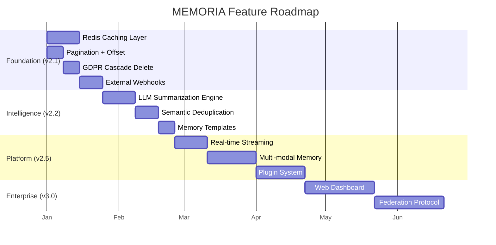
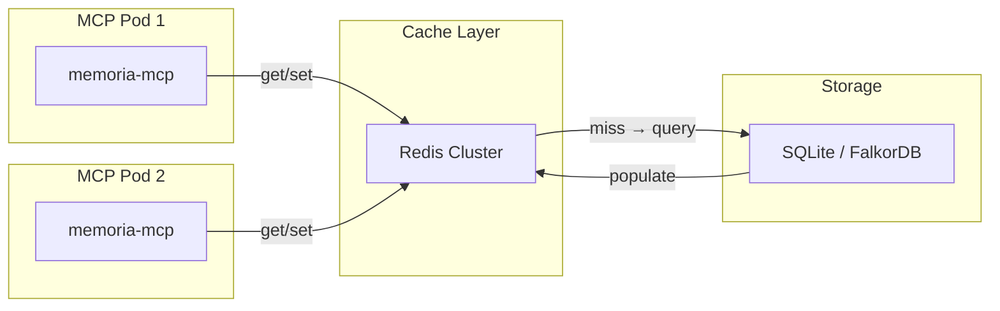
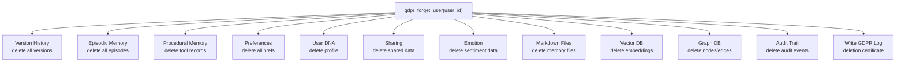
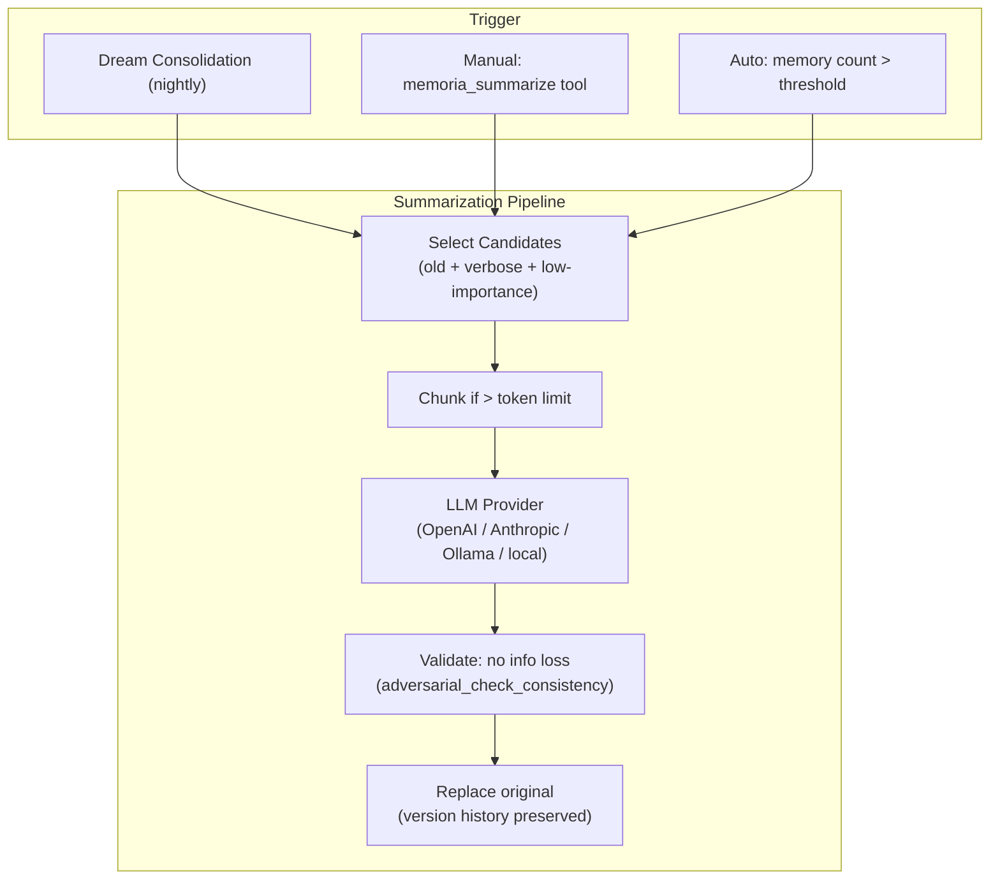
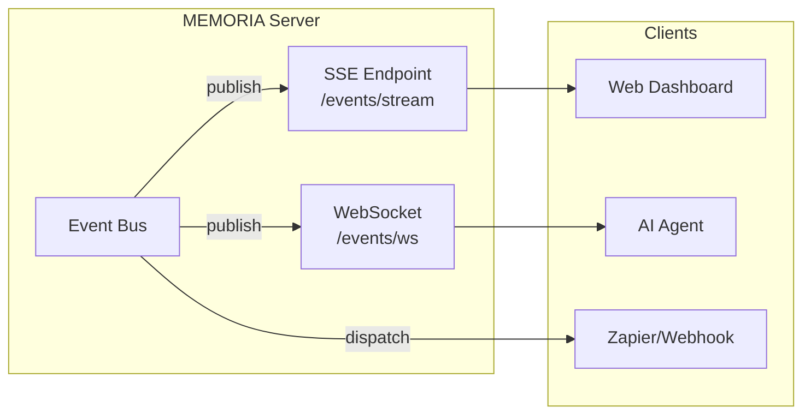
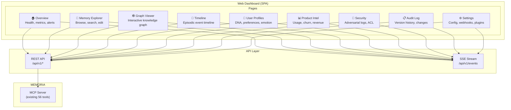
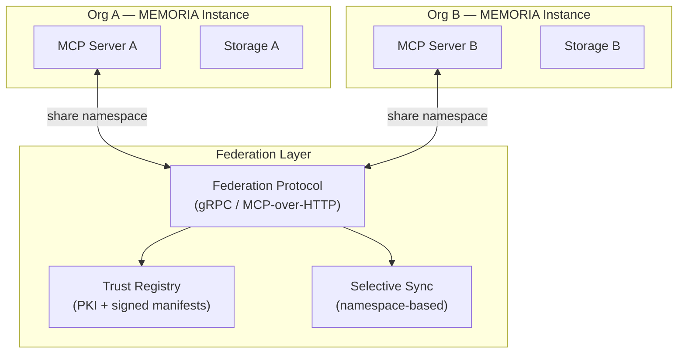
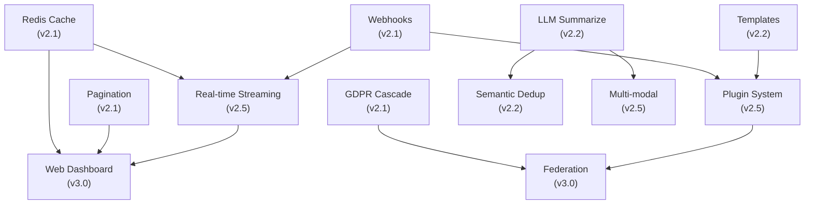

# MEMORIA — Feature Roadmap & Implementation Plans

> **Detailed technical plans for next-generation features**
>
> v2.0.0 → v3.0.0 | BSL 1.1

---

## Roadmap Overview



---

## Phase 1: Foundation (v2.1)

### 1.1 Redis Caching Layer

**Why:** Multi-pod Kubernetes deployments need shared cache. Current in-memory `CachedEmbedder` is per-process only.

**Architecture:**



**Implementation plan:**

| Step | File | Change |
|------|------|--------|
| 1 | `src/memoria/cache/__init__.py` | Create cache module with abstract `CacheBackend` interface |
| 2 | `src/memoria/cache/memory.py` | In-memory LRU backend (current behavior, default) |
| 3 | `src/memoria/cache/redis.py` | Redis backend with connection pooling + serialization |
| 4 | `src/memoria/cache/factory.py` | Factory that reads `MEMORIA_CACHE_BACKEND` env var |
| 5 | `src/memoria/__init__.py` | Inject cache into Memoria class, use in `search()` and `suggest()` |
| 6 | `src/memoria/vector/embeddings.py` | Replace `CachedEmbedder` with new cache backend |
| 7 | `pyproject.toml` | Add `cache = ["redis>=5.0"]` optional dep |
| 8 | `docker-compose.yml` | Redis service already exists (FalkorDB), reuse or add dedicated |

**Cache key strategy:**

```python
class CacheBackend(ABC):
    @abstractmethod
    async def get(self, key: str) -> Optional[bytes]: ...

    @abstractmethod
    async def set(self, key: str, value: bytes, ttl: int = 3600): ...

    @abstractmethod
    async def invalidate(self, pattern: str): ...

# Key patterns:
# embed:{hash(text)}           → embedding vector (TTL: 24h)
# search:{hash(query+params)}  → search results (TTL: 5min)
# profile:{user_id}            → user profile (TTL: 15min)
# suggest:{hash(context)}      → suggestions (TTL: 5min)
```

**Environment variables:**

| Variable | Default | Description |
|----------|---------|-------------|
| `MEMORIA_CACHE_BACKEND` | `memory` | `memory` or `redis` |
| `MEMORIA_REDIS_URL` | `redis://localhost:6379/0` | Redis connection string |
| `MEMORIA_CACHE_TTL` | `3600` | Default TTL in seconds |
| `MEMORIA_CACHE_PREFIX` | `memoria:` | Key prefix for namespacing |

**Tests needed:** ~30 tests covering both backends, TTL expiry, invalidation, connection failures, serialization.

**Risk:** Low — additive feature, in-memory default preserves current behavior.

---

### 1.2 Pagination with Offset

**Why:** Current search only supports `limit`. Large datasets need cursor/offset pagination.

**Implementation plan:**

| Step | File | Change |
|------|------|--------|
| 1 | `src/memoria/__init__.py` | Add `offset` param to `search()`, `search_tiers()`, `episodic_search()` |
| 2 | `src/memoria/core/store.py` | File-based search: skip first N results |
| 3 | `src/memoria/vector/client.py` | SQLite vec: `LIMIT ? OFFSET ?` |
| 4 | `src/memoria/graph/client.py` | Cypher: `SKIP ? LIMIT ?` |
| 5 | `src/memoria/mcp/server.py` | Add `offset` param to search MCP tools |
| 6 | All search MCP tools | Add `total_count` to response for client pagination |

**API change (non-breaking):**

```python
# Before
results = m.search("query", limit=10)

# After (offset is optional, defaults to 0)
page1 = m.search("query", limit=10, offset=0)
page2 = m.search("query", limit=10, offset=10)

# Response includes total count
# {"results": [...], "total": 42, "offset": 0, "limit": 10}
```

**MCP tool change:**

```json
{
  "name": "memoria_search",
  "inputSchema": {
    "properties": {
      "query": {"type": "string"},
      "limit": {"type": "integer", "default": 10},
      "offset": {"type": "integer", "default": 0}
    }
  }
}
```

**Tests needed:** ~15 tests for offset pagination across all search backends.

**Risk:** Low — additive parameter, backward compatible.

---

### 1.3 GDPR Cascade Delete

**Why:** Enterprise deployments need complete data removal across all subsystems when a user requests deletion.

**Implementation plan:**

| Step | File | Change |
|------|------|--------|
| 1 | `src/memoria/gdpr/__init__.py` | New module with `GDPRManager` class |
| 2 | `src/memoria/gdpr/manager.py` | `forget_user(user_id)` — cascading delete across all stores |
| 3 | `src/memoria/gdpr/pii.py` | PII detection (regex-based: email, phone, SSN, credit card) |
| 4 | `src/memoria/gdpr/export.py` | `export_user_data(user_id)` → JSON dump (right to portability) |
| 5 | `src/memoria/__init__.py` | Add `gdpr_forget()`, `gdpr_export()`, `gdpr_scan_pii()` methods |
| 6 | `src/memoria/mcp/server.py` | New tools: `gdpr_forget_user`, `gdpr_export_data`, `gdpr_scan_pii` |

**Cascade delete flow:**



**Deletion certificate:**

```python
@dataclass
class DeletionCertificate:
    user_id: str
    requested_at: datetime
    completed_at: datetime
    subsystems_cleared: list[str]
    items_deleted: dict[str, int]  # {"memories": 42, "episodes": 5, ...}
    certificate_id: str  # UUID for audit reference
```

**PII Scanner:**

```python
class PIIScanner:
    PATTERNS = {
        "email": r"\b[\w.-]+@[\w.-]+\.\w+\b",
        "phone": r"\b\+?\d{1,3}[-.\s]?\(?\d{1,4}\)?[-.\s]?\d{1,4}[-.\s]?\d{1,9}\b",
        "ssn": r"\b\d{3}-\d{2}-\d{4}\b",
        "credit_card": r"\b\d{4}[-\s]?\d{4}[-\s]?\d{4}[-\s]?\d{4}\b",
        "ip_address": r"\b\d{1,3}\.\d{1,3}\.\d{1,3}\.\d{1,3}\b",
    }

    def scan(self, content: str) -> list[PIIMatch]:
        """Scan content for PII patterns, return matches with positions."""
```

**Tests needed:** ~40 tests covering cascade delete, PII detection, export format, deletion certificate.

**Risk:** Medium — touches many subsystems, needs careful integration testing.

---

### 1.4 External Webhooks

**Why:** Enable MEMORIA to notify external systems (Slack, Zapier, custom apps) when memories change.

**Implementation plan:**

| Step | File | Change |
|------|------|--------|
| 1 | `src/memoria/webhooks/__init__.py` | New module |
| 2 | `src/memoria/webhooks/registry.py` | `WebhookRegistry` — register/unregister webhook URLs |
| 3 | `src/memoria/webhooks/dispatcher.py` | Async HTTP dispatcher with retry + circuit breaker |
| 4 | `src/memoria/webhooks/payloads.py` | Standard payload schemas per event type |
| 5 | `src/memoria/comms/bus.py` | Bridge event bus → webhook dispatcher |
| 6 | `src/memoria/mcp/server.py` | New tools: `webhook_register`, `webhook_unregister`, `webhook_list` |
| 7 | `pyproject.toml` | httpx already a dep (via fastmcp) |

**Webhook payload schema:**

```json
{
  "event_type": "memory_created",
  "timestamp": "2025-03-22T14:30:00Z",
  "webhook_id": "wh_abc123",
  "data": {
    "memory_id": "a1b2c3d4.md",
    "content_preview": "User prefers TypeScript...",
    "user_id": "daniel",
    "tier": "core",
    "importance": 0.85
  },
  "signature": "sha256=..."
}
```

**Event types:**

| Event | Trigger |
|-------|---------|
| `memory.created` | New memory stored |
| `memory.updated` | Memory content changed |
| `memory.deleted` | Memory removed |
| `memory.promoted` | Tier promotion (working → core) |
| `episode.started` | New episodic session |
| `episode.ended` | Episode closed |
| `churn.detected` | Churn risk > threshold |
| `anomaly.detected` | Adversarial scan triggered |
| `overload.detected` | Cognitive overload threshold |

**Dispatcher with retry:**

```python
class WebhookDispatcher:
    MAX_RETRIES = 3
    RETRY_DELAYS = [1, 5, 30]  # seconds

    async def dispatch(self, webhook: Webhook, payload: dict):
        """Send webhook with exponential backoff retry."""
        for attempt in range(self.MAX_RETRIES):
            try:
                async with httpx.AsyncClient() as client:
                    response = await client.post(
                        webhook.url,
                        json=payload,
                        headers={
                            "X-Memoria-Signature": self._sign(payload, webhook.secret),
                            "X-Memoria-Event": payload["event_type"],
                        },
                        timeout=10,
                    )
                    if response.status_code < 400:
                        return  # Success
            except httpx.TimeoutException:
                await asyncio.sleep(self.RETRY_DELAYS[attempt])

        # Mark webhook as failing after max retries
        webhook.consecutive_failures += 1
        if webhook.consecutive_failures >= 10:
            webhook.active = False  # Circuit breaker
```

**Tests needed:** ~25 tests with httpx mock for webhook delivery, retry, circuit breaker, signature verification.

**Risk:** Low — additive, no changes to existing behavior.

---

## Phase 2: Intelligence (v2.2)

### 2.1 LLM-Powered Summarization Engine

**Why:** Over time, memories accumulate verbose content. Auto-summarization compresses them while preserving key information.

**Architecture:**



**Implementation plan:**

| Step | File | Change |
|------|------|--------|
| 1 | `src/memoria/intelligence/__init__.py` | New module |
| 2 | `src/memoria/intelligence/summarizer.py` | `Summarizer` class with pluggable LLM backends |
| 3 | `src/memoria/intelligence/providers/` | OpenAI, Anthropic, Ollama, local (transformers) |
| 4 | `src/memoria/intelligence/chunker.py` | Token-aware chunking for long memories |
| 5 | `src/memoria/consolidation/dream.py` | Integrate summarization into dream cycle |
| 6 | `src/memoria/__init__.py` | Add `summarize()`, `summarize_user()` methods |
| 7 | `src/memoria/mcp/server.py` | New tools: `memoria_summarize`, `memoria_summarize_all` |

**LLM Provider interface:**

```python
class LLMProvider(ABC):
    @abstractmethod
    async def summarize(self, content: str, max_tokens: int = 200) -> str: ...

    @abstractmethod
    async def extract_key_facts(self, content: str) -> list[str]: ...

class OllamaProvider(LLMProvider):
    """Local LLM via Ollama (default, zero-cost, private)."""
    model: str = "llama3.2:3b"

class OpenAIProvider(LLMProvider):
    """OpenAI API (GPT-4o-mini for cost efficiency)."""

class AnthropicProvider(LLMProvider):
    """Anthropic API (Haiku for summarization)."""
```

**Environment variables:**

| Variable | Default | Description |
|----------|---------|-------------|
| `MEMORIA_LLM_PROVIDER` | `none` | `none`, `ollama`, `openai`, `anthropic` |
| `MEMORIA_LLM_MODEL` | `llama3.2:3b` | Model name for summarization |
| `MEMORIA_LLM_API_KEY` | | API key for cloud providers |
| `MEMORIA_SUMMARIZE_THRESHOLD` | `500` | Char count above which summarization triggers |

**Tests needed:** ~30 tests with mocked LLM responses, chunking, validation, version preservation.

**Risk:** Medium — requires LLM dependency (optional), but default `none` preserves current behavior.

---

### 2.2 Semantic Deduplication

**Why:** Prevent storing near-identical memories that waste storage and confuse search results.

**Implementation plan:**

| Step | File | Change |
|------|------|--------|
| 1 | `src/memoria/dedup/__init__.py` | New module |
| 2 | `src/memoria/dedup/detector.py` | `DuplicateDetector` using cosine similarity on embeddings |
| 3 | `src/memoria/dedup/merger.py` | `MemoryMerger` — combine duplicates preserving best metadata |
| 4 | `src/memoria/__init__.py` | Add dedup check in `add()` method |
| 5 | `src/memoria/mcp/server.py` | New tools: `memoria_find_duplicates`, `memoria_merge_duplicates` |
| 6 | `src/memoria/consolidation/dream.py` | Add dedup pass in dream cycle |

**Detection algorithm:**

```python
class DuplicateDetector:
    SIMILARITY_THRESHOLD = 0.92  # Configurable

    def find_duplicates(self, content: str, existing_memories: list) -> list[DuplicateMatch]:
        """
        1. Embed the new content
        2. Compare against existing embeddings (vector search)
        3. Filter by cosine similarity > threshold
        4. Return ranked duplicate candidates
        """

    def is_duplicate(self, content: str) -> Optional[str]:
        """Quick check: returns existing memory_id if duplicate found, None otherwise."""
```

**Behavior on add():**

```python
# In Memoria.add():
if self.dedup_enabled:
    existing = self.dedup.is_duplicate(content)
    if existing:
        # Option 1: Reject (strict mode)
        return {"status": "duplicate", "existing_id": existing}
        # Option 2: Merge (smart mode)
        return self._merge_memory(existing, content)
        # Option 3: Warn (permissive mode)
        return {"status": "created", "warning": "similar_memory_exists", ...}
```

**Environment variables:**

| Variable | Default | Description |
|----------|---------|-------------|
| `MEMORIA_DEDUP_ENABLED` | `false` | Enable deduplication |
| `MEMORIA_DEDUP_THRESHOLD` | `0.92` | Cosine similarity threshold |
| `MEMORIA_DEDUP_MODE` | `warn` | `reject`, `merge`, `warn` |

**Tests needed:** ~25 tests for similarity detection, merge logic, threshold tuning, mode behavior.

**Risk:** Low — opt-in feature, default disabled.

---

### 2.3 Memory Templates

**Why:** Pre-built memory schemas for common patterns speed up adoption and enforce consistency.

**Implementation plan:**

| Step | File | Change |
|------|------|--------|
| 1 | `src/memoria/templates/__init__.py` | New module |
| 2 | `src/memoria/templates/registry.py` | `TemplateRegistry` — load/register/list templates |
| 3 | `src/memoria/templates/schema.py` | `MemoryTemplate` dataclass with validation |
| 4 | `src/memoria/templates/builtin/` | 10+ built-in templates |
| 5 | `src/memoria/__init__.py` | `add_from_template()` method |
| 6 | `src/memoria/mcp/server.py` | New tools: `template_list`, `template_apply`, `template_create` |

**Built-in templates:**

```yaml
# templates/builtin/coding_preference.yaml
name: coding_preference
description: "Store a coding/framework/tool preference"
category: developer
fields:
  language:
    type: string
    required: true
    description: "Programming language"
  framework:
    type: string
    required: false
  style_guide:
    type: string
    required: false
  formatting:
    type: string
    required: false
content_template: |
  User preference: {language} development
  Framework: {framework}
  Style: {style_guide}
  Formatting: {formatting}
tags: ["preference", "coding", "developer"]
default_tier: core
default_importance: 0.8
```

**Templates library:**

| Template | Use Case |
|----------|----------|
| `coding_preference` | Developer language/framework/tool preferences |
| `project_context` | Project description, tech stack, conventions |
| `bug_report` | Bug description, reproduction steps, resolution |
| `meeting_notes` | Meeting summary, decisions, action items |
| `api_endpoint` | API route, params, auth, response schema |
| `design_decision` | ADR — context, decision, consequences |
| `customer_profile` | SaaS customer info, subscription, usage |
| `incident_report` | Incident timeline, root cause, remediation |
| `onboarding_step` | Onboarding task, status, dependencies |
| `knowledge_article` | Documentation with category, tags, links |

**Tests needed:** ~20 tests for template validation, rendering, registry.

**Risk:** Low — additive, no impact on existing memories.

---

## Phase 3: Platform (v2.5)

### 3.1 Real-time Streaming (SSE/WebSocket)

**Why:** Clients need live updates when memories change — for dashboards, collaborative agents, and live debugging.

**Architecture:**



**Implementation plan:**

| Step | File | Change |
|------|------|--------|
| 1 | `src/memoria/streaming/__init__.py` | New module |
| 2 | `src/memoria/streaming/sse.py` | SSE endpoint using FastMCP/Starlette |
| 3 | `src/memoria/streaming/websocket.py` | WebSocket endpoint for bidirectional |
| 4 | `src/memoria/streaming/filters.py` | Client-side event filters (event_type, user_id, namespace) |
| 5 | `src/memoria/comms/bus.py` | Bridge internal events → streaming channels |
| 6 | `src/memoria/mcp/server.py` | Register SSE/WS routes alongside MCP |

**SSE endpoint:**

```python
@app.route("/events/stream")
async def event_stream(request):
    """Server-Sent Events stream for memory changes."""
    filters = EventFilter(
        event_types=request.query_params.getlist("event_type"),
        user_ids=request.query_params.getlist("user_id"),
        namespaces=request.query_params.getlist("namespace"),
    )

    async def generate():
        async for event in event_bus.subscribe(filters):
            yield f"event: {event.type}\ndata: {json.dumps(event.data)}\n\n"

    return StreamingResponse(generate(), media_type="text/event-stream")
```

**Tests needed:** ~20 tests for SSE delivery, WebSocket, filtering, reconnection.

**Risk:** Medium — requires async infrastructure, but FastMCP already supports it.

---

### 3.2 Multi-modal Memory

**Why:** AI agents work with images (screenshots, diagrams), audio (voice commands), and files — not just text.

**Implementation plan:**

| Step | File | Change |
|------|------|--------|
| 1 | `src/memoria/multimodal/__init__.py` | New module |
| 2 | `src/memoria/multimodal/storage.py` | Binary blob storage (file system + S3-compatible) |
| 3 | `src/memoria/multimodal/metadata.py` | EXIF/metadata extraction for images/audio |
| 4 | `src/memoria/multimodal/indexer.py` | Text extraction from images (OCR) and audio (whisper) |
| 5 | `src/memoria/__init__.py` | `add_attachment()`, `get_attachment()` methods |
| 6 | `src/memoria/mcp/server.py` | New tools with base64/URI attachment support |

**Memory with attachments:**

```yaml
# Enhanced markdown format
---
id: a1b2c3d4
type: memory
importance: 0.8
attachments:
  - id: att_001
    type: image/png
    filename: architecture_diagram.png
    size: 145892
    hash: sha256:abc123...
    description: "System architecture diagram from whiteboard"
  - id: att_002
    type: audio/webm
    filename: voice_note.webm
    size: 89234
    duration_seconds: 12.5
    transcript: "Remember to add error handling to the auth flow"
---
User discussed system architecture and recorded voice note about auth improvements.
```

**Storage layout:**

```
~/.memoria/projects/{hash}/
├── memory/           # Markdown files (existing)
│   ├── a1b2c3d4.md
│   └── ...
├── attachments/      # Binary blobs (NEW)
│   ├── att_001.png
│   ├── att_002.webm
│   └── ...
└── vectors.db        # Vector embeddings (existing)
```

**Tests needed:** ~30 tests for storage, metadata extraction, search integration, size limits.

**Risk:** High — significant new storage subsystem, needs careful file management.

---

### 3.3 Plugin System

**Why:** Allow community to extend MEMORIA with custom backends, tools, and processing pipelines.

**Implementation plan:**

| Step | File | Change |
|------|------|--------|
| 1 | `src/memoria/plugins/__init__.py` | New module |
| 2 | `src/memoria/plugins/interface.py` | `MemoriaPlugin` ABC with lifecycle hooks |
| 3 | `src/memoria/plugins/loader.py` | Discover + load plugins from entry points |
| 4 | `src/memoria/plugins/registry.py` | `PluginRegistry` — manage enabled/disabled plugins |
| 5 | `pyproject.toml` | Define `memoria.plugins` entry point group |
| 6 | `src/memoria/mcp/server.py` | Auto-register plugin-provided MCP tools |

**Plugin interface:**

```python
class MemoriaPlugin(ABC):
    """Base class for MEMORIA plugins."""

    @property
    @abstractmethod
    def name(self) -> str: ...

    @property
    @abstractmethod
    def version(self) -> str: ...

    def on_startup(self, memoria: "Memoria") -> None:
        """Called when MEMORIA server starts."""

    def on_shutdown(self) -> None:
        """Called on graceful shutdown."""

    def on_memory_created(self, memory_id: str, content: str, metadata: dict) -> None:
        """Hook: after a memory is created."""

    def on_memory_searched(self, query: str, results: list) -> list:
        """Hook: modify search results before returning."""

    def register_tools(self) -> list[Tool]:
        """Return list of MCP tools this plugin provides."""

    def register_backends(self) -> dict[str, Any]:
        """Return custom storage backends."""
```

**Plugin discovery (entry points):**

```toml
# In a plugin's pyproject.toml:
[project.entry-points."memoria.plugins"]
my_plugin = "my_memoria_plugin:MyPlugin"
```

```python
# In MEMORIA:
from importlib.metadata import entry_points

def discover_plugins() -> list[MemoriaPlugin]:
    eps = entry_points(group="memoria.plugins")
    return [ep.load()() for ep in eps]
```

**Example plugins:**

| Plugin | Purpose |
|--------|---------|
| `memoria-slack` | Send webhook notifications to Slack channels |
| `memoria-qdrant` | Qdrant vector database backend |
| `memoria-pinecone` | Pinecone vector backend |
| `memoria-neo4j` | Neo4j graph database backend |
| `memoria-openai` | OpenAI embeddings + summarization |
| `memoria-langchain` | LangChain memory adapter |

**Tests needed:** ~25 tests for plugin loading, lifecycle hooks, tool registration, isolation.

**Risk:** Medium — public API contract must be stable for plugin compatibility.

---

## Phase 4: Enterprise (v3.0)

### 4.1 Web Dashboard

**Why:** Most visible missing feature. Administrators need visual tools for monitoring, exploring, and managing AI memories.

**Tech stack:**

| Component | Choice | Why |
|-----------|--------|-----|
| Frontend | React 18 + TypeScript | Industry standard, rich ecosystem |
| Build | Vite | Fast builds, HMR |
| Styling | Tailwind CSS | Utility-first, rapid development |
| Charts | Recharts | React-native charting |
| Graph viz | D3.js + force layout | Knowledge graph visualization |
| State | Zustand | Lightweight state management |
| API client | TanStack Query | Caching, pagination, real-time |
| Backend | FastAPI (or existing FastMCP) | REST endpoints for dashboard |

**Architecture:**



**Dashboard pages:**

```
dashboard/
├── src/
│   ├── pages/
│   │   ├── Overview.tsx        # Health dashboard, key metrics
│   │   ├── MemoryExplorer.tsx  # Search, browse, CRUD memories
│   │   ├── GraphViewer.tsx     # Interactive D3 knowledge graph
│   │   ├── Timeline.tsx        # Episodic event timeline (vertical)
│   │   ├── UserProfiles.tsx    # DNA, preferences, emotion history
│   │   ├── ProductIntel.tsx    # Usage charts, churn heatmap, revenue signals
│   │   ├── Security.tsx        # Adversarial scan logs, ACL management
│   │   ├── AuditLog.tsx        # Version history, change diffs
│   │   └── Settings.tsx        # Config, webhooks, plugin management
│   ├── components/
│   │   ├── MemoryCard.tsx      # Single memory display with metadata
│   │   ├── SearchBar.tsx       # Unified search with filters
│   │   ├── KnowledgeGraph.tsx  # D3 force-directed graph
│   │   ├── MetricCard.tsx      # KPI metric display
│   │   ├── ChurnHeatmap.tsx    # Product churn risk visualization
│   │   └── EmotionTimeline.tsx # Emotion tracking over time
│   ├── hooks/
│   │   ├── useMemoria.ts       # React Query hooks for MEMORIA API
│   │   └── useSSE.ts           # Server-Sent Events hook
│   └── api/
│       └── client.ts           # API client (calls MEMORIA MCP via REST bridge)
├── package.json
├── vite.config.ts
└── Dockerfile                  # Nginx static serve
```

**Key visualizations:**

1. **Knowledge Graph** — Interactive D3 force layout showing entities + relationships
2. **Memory Timeline** — Vertical timeline of episodic events with importance sizing
3. **Churn Heatmap** — Product grid colored by churn risk score
4. **Emotion Chart** — Line chart of emotion valence over time
5. **Cognitive Load** — Gauge showing current overload risk
6. **Usage Funnel** — Product adoption funnel from register → active → power user

**Tests needed:** ~50 (component tests with Vitest + Playwright E2E for critical flows).

**Risk:** High — large frontend project, separate build pipeline, new tech stack.

---

### 4.2 Federation Protocol

**Why:** Multi-organization deployments where separate MEMORIA instances need to share knowledge securely.

**Architecture:**



**Implementation plan:**

| Step | File | Change |
|------|------|--------|
| 1 | `src/memoria/federation/__init__.py` | New module |
| 2 | `src/memoria/federation/protocol.py` | Federation protocol (gRPC or MCP-over-HTTP) |
| 3 | `src/memoria/federation/trust.py` | PKI-based trust management |
| 4 | `src/memoria/federation/sync.py` | Selective namespace sync (pull/push) |
| 5 | `src/memoria/federation/conflict.py` | Conflict resolution (CRDT-based) |
| 6 | `src/memoria/mcp/server.py` | New tools: `federation_connect`, `federation_sync`, `federation_trust` |

**Federation manifest:**

```yaml
# federation.yaml
instance_id: "org-a-memoria-prod"
version: "2.5.0"
public_key: "ed25519:abc123..."
endpoints:
  mcp: "https://memoria.org-a.com/mcp"
  federation: "https://memoria.org-a.com/federation"
shared_namespaces:
  - name: "industry-knowledge"
    direction: "bidirectional"
    filter: "importance >= 0.7"
  - name: "best-practices"
    direction: "push"
    filter: "tier == 'core'"
trusted_peers:
  - instance_id: "org-b-memoria-prod"
    public_key: "ed25519:def456..."
    namespaces: ["industry-knowledge"]
```

**Conflict resolution (CRDT):**

```python
class FederationConflictResolver:
    """Last-Writer-Wins with vector clock for ordering."""

    def resolve(self, local: Memory, remote: Memory) -> Memory:
        if local.vector_clock > remote.vector_clock:
            return local
        if remote.vector_clock > local.vector_clock:
            return remote
        # Concurrent: merge metadata, keep highest importance
        return self._merge(local, remote)
```

**Tests needed:** ~40 tests for protocol, trust verification, sync, conflict resolution.

**Risk:** High — distributed systems complexity, security implications, new protocol design.

---

## Implementation Priority Matrix

```
                    High Impact
                        │
    ┌───────────────────┼───────────────────┐
    │                   │                   │
    │  Redis Cache      │  Web Dashboard    │
    │  Webhooks         │  LLM Summarize    │
    │  Pagination       │  Real-time Stream │
    │                   │                   │
Low ├───────────────────┼───────────────────┤ High
Effort│                 │                   │ Effort
    │  GDPR Cascade    │  Multi-modal      │
    │  Templates       │  Federation       │
    │  Dedup           │  Plugin System    │
    │                   │                   │
    └───────────────────┼───────────────────┘
                        │
                    Low Impact
```

**Recommended order:**
1. **Redis + Pagination + GDPR** (v2.1) — Foundation, low effort, high impact
2. **Webhooks + Templates** (v2.1) — Quick integration wins
3. **LLM Summarize + Dedup** (v2.2) — Intelligence boost
4. **Real-time Streaming** (v2.5) — Platform capability
5. **Plugin System** (v2.5) — Ecosystem enabler
6. **Multi-modal** (v2.5) — Richer memories
7. **Web Dashboard** (v3.0) — Full admin experience
8. **Federation** (v3.0) — Enterprise multi-org

---

## Dependency Map



---

**MEMORIA v2.0.0** — Building the future of AI memory, one feature at a time.

© 2024-2026 Daniel Nicusor Naicu. All rights reserved.
Business Source License 1.1 — see [LICENSE](../LICENSE).
